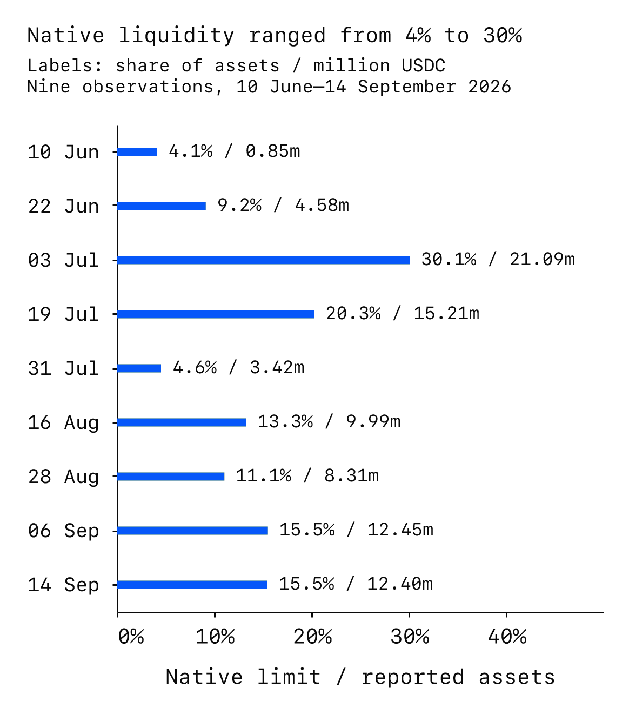
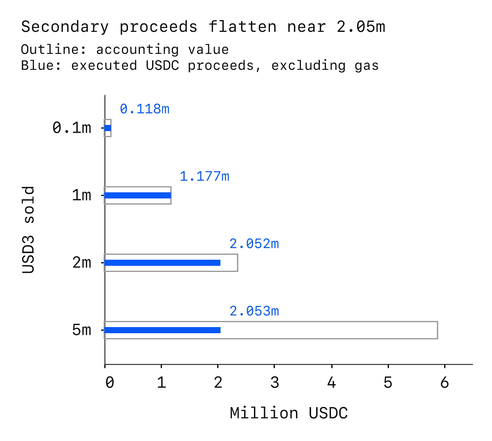

---
{
  "title": "Asset Review: 3Jane USD3",
  "description": "USD3 is the senior share of 3Jane’s pooled lending strategy. Depositors supply USDC and receive a token representing an interest in the pool; yield depends on Aave income and credit income, with part allocated to the junior sUSD3 tranche. Seniority is a loss-allocation mechanism, not a promise of an immediately redeemable dollar. The official deployment is an upgradeable Ethereum contract.",
  "publishedAt": "2026-09-08",
  "tokenLogo": "../../assets/reports/usd3-ethereum/figures/token-logo.svg",
  "draft": false,
  "reviewedBy": [
    "Wavey"
  ]
}
---

# Asset Review:  3Jane USD3

| Item | Detail |
| --- | --- |
| Asset |  3Jane USD3 |
| Asset type | Senior credit-pool share |
| Deployment | Ethereum ([0x056B…5eCc](https://etherscan.io/address/0x056B269Eb1f75477a8666ae8C7fE01b64dD55eCc)) |
| Review date | 14 September 2026 |

- [Overview](#overview)
- [Issuer and organization](#issuer-and-organization)
- [Mechanics and dependencies](#mechanics-and-dependencies)
- [Governance and control](#governance-and-control)
- [Exits and market liquidity](#exits-and-market-liquidity)
- [Valuation and oracle considerations](#valuation-and-oracle-considerations)
- [Security and operational history](#security-and-operational-history)
- [Collateral considerations](#collateral-considerations)
- [Open questions](#open-questions)

## Overview

USD3 is the senior share of 3Jane’s pooled lending strategy. Depositors supply USDC and receive a token representing an interest in the pool; yield depends on Aave income and credit income, with part allocated to the junior sUSD3 tranche. Seniority is a loss-allocation mechanism, not a promise of an immediately redeemable dollar. The official deployment is an upgradeable Ethereum contract.[^addresses][^suppliers][^usd3-code]

The vault reports 80.02 million USDC of assets against 67.99 million USD3 shares, equivalent to 1.176892 USDC per share. Credit represents 84.5% of reported assets; the operator’s Slope loan purchases alone represent about 71%. The 7.66 million USDC junior claim provides meaningful protection against limited losses, but recoverable value ultimately depends on concentrated offchain credit, timely loss recognition and the return of collections to the pool.[^state][^facility-data]

- **Finite first-loss protection.** The junior claim equals 9.6% of reported assets. Fork tests confirmed that locked profit and junior shares can absorb a smaller impairment and preserve senior share value. A sufficiently large loss exhausts that protection.[^state][^simulations]
- **Usable but limited exits.** Native liquidity is approximately 12.40 million USDC, or 15.5% of reported assets. A complete Curve route returned about 1.177 million USDC for one million USD3; selling two million shares incurred a 12.84% discount to accounting value. Available liquidity is much smaller than outstanding claims.[^state][^simulations]
- **Recognition can interrupt access.** An unreported accounting shortfall blocks withdrawals, and the routine keeper currently rejects loss reports. Management intervention restored access in the smaller-loss test; neither the displayed share price nor seniority ensures uninterrupted redemption.[^usd3-code][^simulations]
- **Recovery depends on unverified legal protections.** Public disclosures describe receivable ownership, secured facilities and controlled collections. Executed documents establishing the creditor, priority and recovery path to USD3 were unavailable. Thousands of underlying loans still share originators, servicers and protocol control.[^facility-data][^fcc-legal]

## Issuer and organization

3Jane was founded by Jacob Chudnovsky and raised a reported $5.2 million seed round led by Paradigm in June 2025. That history provides context for the team’s credit-market ambitions, but the funding announcement establishes neither current operating resources nor capital committed to protect USD3 holders.[^organization]

The website terms identify Tulkum Assets Corp., a Panamanian corporation, as the operator. The terms are dated 1 September 2025 and describe the earlier crypto-credit product. They contain broad disclaimers, restrict claims against affiliates and provide for Panama law and individual arbitration. They do not establish the executed legal chain for the fintech facilities described in newer product materials.[^terms]

3Jane’s current product documentation describes a common capital pool funding fintech credit facilities and direct crypto credit. For fintech facilities, the disclosed structure uses a bankruptcy-remote special-purpose vehicle, a senior secured position or purchased receivables, and controlled collection accounts. These arrangements are issuer disclosures; they do not themselves establish the identity of the secured creditor, perfection of its security interest or USD3 holders’ enforceable rights.[^fcc-legal]

The first disclosed warehouse facility is a $10 million commitment to LendSwift, with a 75% advance rate, 25% originator first-loss equity and a 15% facility coupon. The documentation describes a revolving period ending 26 May 2027 and final maturity on 26 November 2027. A commitment is not the same as funded principal, and a pool of short-duration receivables does not promise prompt repayment of the warehouse lender while collections continue to revolve.[^fcc-facilities]

The live facility data reports a much larger Slope forward-flow position: $56.75 million principal across 1,580 SMB credit lines as of 10 September 2026. Slope is the named servicer; the backup is described only as a cold backup servicer. The data reports a 100% advance rate for this position. LendSwift’s originator equity should therefore not be treated as protection for the Slope book. The Slope loan tape is not public in the application’s facility configuration.[^facility-data]

Slope separately announced $60 million of cumulative whole-loan purchases by 3Jane and a $50 million holding level under a facility announced in June. This corroborates the commercial relationship, while leaving the current receivables, legal ownership and servicing protections dependent on the operator disclosures and executed agreements.[^slope]

The operator reports 96.2% of Slope principal as current, with the remaining balance spread across delinquency buckets and no recorded charge-offs. The pool is in amortization, with a reported 46-day weighted remaining term. Those figures support a shorter expected collection horizon than the LendSwift warehouse, but neither projected collections nor a “current” classification guarantees recovery. The published record is short relative to the enlarged book and does not establish performance through a sustained downturn.[^facility-data]

LendSwift reports $5.71 million of principal funded against $8.26 million of eligible collateral across 21,303 consumer loans as of 11 September. Only 61.6% of the reported loan balance is current. Its underlying weighted borrower APR is approximately 693%, whereas the warehouse coupon is 15%. High borrower charges do not translate directly into lender returns: missed payments, enforceability, servicing expenses and losses intervene. The public vintage collection figures are not a substitute for a reconciled charge-off and recovery record.[^facility-data]

The dashboard also attributes $3.08 million to bank staging at Erebor, without a balance date or independent bank attestation. OCC records confirm Erebor Bank’s charter, but do not establish the account owner, restrictions, balance or deposit-insurance treatment of these particular funds. Bank staging is also absent from the cash immediately redeemable through USD3’s contracts.[^state][^bank]

The decisive legal uncertainty is the documented route from receivable ownership through enforcement and controlled collections back to USD3. Public summaries and an unsigned advance-agreement template do not establish executed facility terms, the responsible creditor and account owner, perfection, backup servicing or insolvency priority. This is missing verification of the claimed protections, not evidence that the protections do not exist.[^fcc-legal][^terms]

## Mechanics and dependencies

The deployed strategy wraps USDC into Aave’s waUSDC and holds the resulting shares locally or supplies them to a designated MorphoCredit market. Its asset estimate adds idle USDC to the USDC conversion value of those two waUSDC positions. This accounting does not independently appraise the enforceability or sale value of an underlying borrower’s assets.[^usd3-code]

Credit accounts for 67.64 million USDC, equivalent to 84.5% of reported assets. The borrower census reconciles to the market’s total shares, but 97.4% of credit debt sits in a single staging Safe controlled by the protocol’s main Safe. The operator’s facility balances and bank staging balance explain its broad economic purpose, while different reporting dates and accrued interest prevent an exact independent reconciliation. Onchain borrower count therefore overstates economic diversification if treated as a count of independent credit counterparties.[^state][^facility-data]

waUSDC converts through Aave’s USDC liquidity index. Its reported assets are approximately 73.17 million USDC across all wrapper holders, which is a different accounting scope from USD3’s credit ledger: borrowers can redeem borrowed waUSDC and move the resulting USDC offchain. Aave liquidity cannot be counted as extra USD3 backing or used to compel those borrowers to repay.[^state][^dependencies]

The MorphoCredit market is a modified credit system: its nominal collateral fields record credit limits and do not represent locked, liquidatable borrower collateral. Recovery depends on repayment, insurance or authorized settlement. A borrower’s verifiable assets used for underwriting are not necessarily assets the pool can seize. The current proof-verifier address is zero.[^state][^credit-code]

Deployment is constrained by both a configurable credit-allocation percentage and a cap derived from the value of sUSD3’s holdings. A zero backing-ratio setting disables the latter constraint. When the junior tranche withdraws, the strategy attempts to pull excess deployment back from MorphoCredit. That attempt is limited by market liquidity: a lower deployment target does not force borrowers to repay immediately.[^usd3-code]

The current credit-allocation ceiling is 100% and the percentage backing ratio is zero. A separate 7.5 million USDC nominal floor restricts ordinary sUSD3 withdrawals, leaving only about 160,394 USDC of junior value above that floor. The junior tranche has no initial lock under current settings, but withdrawal requires a 30-day cooldown. Its cooldown and backing floor are bypassed during junior shutdown, after the checks for unreported losses. These distinctions matter more than the documentation’s illustrative 15% tranche ratio.[^state][^susd3-code]

Loss absorption occurs when the strategy reports a loss. The contract calculates the shares needed to cover the loss using the pre-report share value, subtracts shares already burned against locked profit, and burns the remainder from sUSD3’s USD3 holdings, up to their balance. The junior layer is therefore a finite pool of risk capital, not an external guarantee.[^usd3-code]

The deployment-cap formula counts sUSD3’s USD3 balance without establishing its funding source. Guardian identified how debt-funded shares transferred through another wallet could inflate that cap. The current zero backing ratio already disables this percentage constraint. Existing junior shares remain burnable, but their measured value does not establish independently financed capital or a separate cash reserve; the public funding trail does not resolve that distinction.[^usd3-code][^state][^guardian]

A separate insurance contract holds waUSDC worth approximately 1.03 million USDC. Credit-line management must activate its use through an authorized settlement; its assets are not automatically added to USD3’s first-loss buffer. Repayment rules and payment-cycle state also constrain execution. Insurance resources are finite, and JANE governance-token value is not counted as cash protection.[^state][^credit-code]

The current profit allocation sends 7.5% of reported profit to sUSD3 through the performance-fee mechanism. Remaining profit unlocks over three days. Accrued loan interest can increase accounting value before it has been collected, so distributed income and realized cash are different measures. Junior holders accept first-loss exposure in exchange for that allocation; their claim consists of USD3 held inside sUSD3, not a separate reserve of USDC.[^usd3-code][^state][^susd3-code]

Two isolated loss simulations establish how recognition affects access. Writing off a smaller borrower without insurance created approximately 485,000 USDC of net reported loss after pending income. Withdrawals stopped; the standard keeper’s report failed because its loss tolerance is zero. Direct management reports for USD3 and then sUSD3 absorbed the loss through locked profit and junior shares and restored ordinary redemption at approximately the previous share value. A zero-recovery write-off of the staging account exhausted junior capital and reduced redemption value to about 0.230 USDC per USD3 before access resumed. These are conditional stress tests using existing balances and authorized accounting paths, with management approval and the timelock delay assumed already complete; they are not forecasts or demonstrations of ordinary-user privileges.[^simulations]

### Token behavior and restrictions

USD3 uses ordinary balance transfers and allowances, with permit support and no transfer fee in the current implementation; transfers directly to the USD3 vault itself revert. Its configurable commitment period is zero and the deposit whitelist is disabled. Deposit eligibility is controlled separately: the implementation checks whether the recipient has debt in its own credit market and requires a 1,000 USDC minimum first deposit. This recipient check does not establish the payer’s funding source. The 80 million USDC supply cap is already exceeded by accrued reported assets, so current deposit limits return zero.[^usd3-code][^state][^tokenized-code]

## Governance and control

The main controller is a 3-of-5 Safe. It proposes and cancels operations through a 24-hour parameter timelock and a separate seven-day upgrade timelock. The core proxy administrators are owned by the upgrade timelock; routine credit configuration and management run through the parameter timelock. The staging account is a 1-of-1 Safe whose sole owner is the main Safe, so its effective control remains the same 3-of-5 group. The inspected Safes have no enabled modules or guards. The threshold is verifiable; the five signers’ identities and independence are not established by their addresses.[^controls]

These controllers can change credit limits, repayment obligations, valuation-related settings, caps, junior protection requirements and deposit eligibility. Upgrade authority can change token and vault behavior after the delay. The junior allocation can be raised through configuration, potentially directing all newly reported profit through the performance-fee mechanism. Current settings are therefore policy choices, not immutable promises.[^usd3-code][^controls]

An emergency controller can impose restrictive changes immediately, including pausing the protocol and reducing debt, supply and deployment caps. Its callable paths do not grant new credit or perform settlement. The distinction matters: emergency restriction is faster than authorized loss recognition and restoration. The keeper’s current zero-loss health check blocks a routine loss report; management can change the check or report directly, subject to its effective authority. Neither the seven-day upgrade delay nor the emergency role should be read as a universal delay or universal recovery power.[^simulations][^controls]

USDC and Aave introduce separate controls. Circle can pause USDC and blacklist addresses; Aave governance and emergency controls can alter or interrupt reserves, and waUSDC itself is pausable and upgradeable. These controls can stop the redemption path even while USD3 balances remain transferable. No relevant pause or blacklist prevented the tested native exits.[^dependencies]

## Exits and market liquidity

Native redemption returns USDC by using idle USDC, redeeming locally held waUSDC, and withdrawing liquid waUSDC from MorphoCredit when needed. Aave wrapper pause state and underlying liquidity constrain that path. The strategy’s withdrawal-limit calculation also returns zero if its asset estimate is more than two USDC base units below reported assets. This check precedes its shutdown exception, so shutdown does not by itself clear an unreported accounting shortfall.[^usd3-code]

The contract’s three-argument redemption entry point accepts the maximum loss tolerance by default; its four-argument form allows a caller to bound the permitted loss. The withdrawal entry point defaults to zero tolerated loss. Integrators need to distinguish those execution conditions from a displayed conversion rate.[^base-code]

The current native cash limit is approximately 12.40 million USDC. On an isolated fork, zero-loss-tolerance redemptions returned 117,689 USDC for 100,000 USD3, 1,176,892 USDC for one million USD3 and 11,768,923 USDC for ten million USD3. A twelve-million-share redemption reverted before execution. Each case started from the same state, so the results cannot be added together as independent liquidity. They exclude gas costs and subsequent withdrawals, borrowing or pauses.[^simulations]

Native availability has varied materially. Nine observations between 10 June and 14 September place the withdrawal-limit calculation between 4.1% and 30.1% of reported assets. The low observation on 10 June provided only 0.85 million USDC against 20.66 million USDC of assets; on 31 July, 3.42 million USDC was available against 75.05 million. These are discrete observations, not a continuous record or a guaranteed minimum.[^history]

*Figure 1. Native liquidity varied substantially as the pool grew. Source: yRisk historical contract reads. The sample does not establish the lowest availability between observations.*[^history]

The identified Curve USD3/frxUSD pool provides a secondary sale route. It contains approximately 2.06 million frxUSD and 267,545 USD3. A sale of one million USD3 quotes about 1.178 million frxUSD, but two million shares quote only 2.054 million frxUSD: available counter-asset inventory becomes binding quickly. Larger orders approach the same inventory ceiling while dynamic fees and price impact increase. Quotes include pool fees, but exclude gas, intervening trades and any subsequent frxUSD conversion.[^curve]

This depth has not been constant. At the 10 June observation, selling 100,000 USD3 quoted only 49,828 frxUSD. That is a historical size-specific quote, not an executed sale or evidence that every USD3 traded at that price.[^history]

A complete trading route through Curve’s frxUSD/crvUSD and crvUSD/USDC pools returned 118,151 USDC for 100,000 USD3 and 1,176,966 USDC for one million USD3 in isolated fork execution. Two million shares returned 2,051,674 USDC, a 12.84% discount to accounting value; five million returned only 2,053,485 USDC, a 65.10% discount. The first pool’s roughly 2.06 million frxUSD inventory dominates this route’s depth. These are sequential transactions from identical starting states without outside interleaving, including pool fees but excluding gas and MEV. They establish usable current exits, not committed capacity or a safe liquidation size.[^simulations][^curve]

*Figure 2. Larger sales quickly exhaust the route’s counter-asset depth. Source: yRisk isolated fork executions of USD3 → frxUSD → crvUSD → USDC. Pool fees are included; gas, MEV and competing trades are excluded.*[^simulations]

Two direct frxUSD redemption alternatives failed at the larger test sizes. Frax’s USDC custodian had only 20.08 USDC of redeemable cash, while its Treasury-collateral coordinator reached a Superstate redeemer with insufficient USDC. The successful three-pool trading route avoids those specific bottlenecks. Its proceeds still depend on three pools remaining funded and operational; a quote on the USD3/frxUSD pair alone does not establish USDC proceeds.[^simulations][^frax-route]

Concentration can amplify simultaneous exit demand. A Pendle share adapter holds 48.4% of USD3 supply and the canonical Morpho contract holds 21.3%; both aggregate positions for other users, so these are contract holdings rather than proven common beneficial ownership. Their combined token balances considerably exceed immediate native liquidity.[^state]

On the liquidity-provider side, 97.2% of the USD3/frxUSD pool’s LP tokens are staked in its Curve gauge. Two gauge accounts hold positions representing 96.6% of all LP tokens. These accounts can aggregate other users, so the balances do not establish ultimate ownership. Gauge staking does not impose a fixed withdrawal lock. Pool liquidity remains discretionary and can leave through LP withdrawals; it is not a committed credit line.[^lp]

## Valuation and oracle considerations

The relevant unit is a share of a USDC-denominated strategy, not a fixed-dollar bank claim. The strategy’s asset estimate uses its MorphoCredit supply position and Aave’s conversion rate; reported assets and user conversion rates are a separate accounting layer. Assessing realizable value requires identifying when credit impairments reach that accounting and measuring the liquidity available to pay out.[^usd3-code]

The credit market’s current markdown total is zero, and all 76 discovered borrower accounts have markdowns disabled and no nonzero posted amount due. That configuration does not independently establish that all receivables are performing. Markdowns depend on posted repayment obligations, the grace and delinquency clocks, borrower-specific enablement and a transaction that updates the position. The configured grace period is one day, the delinquency period 97 days and the full markdown period 730 days after default. Authorized settlement can instead write off an account at once. A mark that follows this schedule can lag an economically impaired loan; a routine USD3 report accrues market interest but does not enumerate every borrower to discover new impairments.[^state][^credit-code][^markdown-code]

The Curve pool also uses USD3’s own share conversion to normalize its balances. That input is accounting value in USDC per share; it does not independently discover offchain losses or verify native withdrawal capacity. A price feed derived from the same conversion would inherit its recognition delay. Conversely, a market price from this relatively shallow pool can reflect concentrated selling and frxUSD conditions. Converting either observation into a dollar valuation adds USDC or frxUSD price risk. No particular lending-market oracle is assessed here.[^usd3-code][^curve]

## Security and operational history

USD3’s proxy was created in August 2025 and has undergone several upgrades, including a migration from waUSDC to USDC accounting. On 19 April 2026, the controller shut down the strategy and invoked an emergency withdrawal. A 1 May upgrade executed a restart hook and cleared the shutdown flag. The reported share price remained 1.155560 USDC across each transition. Between shutdown and restart, 82 withdrawal events returned approximately 2.32 million USDC, so shutdown did not prevent every holder from exiting. The available records establish those actions, but not why shutdown was necessary, whether some attempted withdrawals failed, or whether users incurred indirect losses.[^operations]

In May, 3Jane described its prior crypto-credit record as seven months of operation, $8 million of originations and no defaults or principal impairment. That is an operator statement about the earlier, much smaller book. The present fintech exposure expanded later and lacks a comparable record through a sustained downturn. An onchain default-start event from September 2025 was followed by a reset obligation and later repayment; it does not establish a lasting loss or resolve differences between contractual and reported default definitions.[^operations][^evolution]

### Audit history

The public history includes multiple reviews of the credit contracts and tranche accounting. Their scope and remediation differ; none is an attestation of receivable value, bank balances or legal enforceability.

Sherlock’s August 2025 review covered the original credit system and USD3/sUSD3, reporting seven high, five medium and three low findings. Topics included settlement accounting, interest accrual, lock griefing and withdrawal accounting. The report records final revisions, but includes acknowledged issues; its “no unaddressed issues” summary is not a statement that every issue was fixed. Veridise’s August 2025 review reported one critical, two high, two medium and five warnings. Its critical, high and medium findings were marked fixed; four warnings were acknowledged. Both reviews predate later deployed revisions.[^sherlock-aug][^veridise]

Two October 2025 reviews added coverage of the credit system and JANE/PYT periphery. Electisec reported one high, two medium and two low findings, plus informational items. The high finding concerned lost Pendle yield; the developer removed that functionality. The later auditor-hosted version, dated 25 November, removes that finding and reports zero high findings, while retaining two medium and two low findings. Cooldown design and JANE burn concerns were acknowledged, as were transfer-whitelist and retroactive-commitment issues.[^electisec]

Sherlock’s October review reported one high and seven medium findings, including overlapping yield and commitment issues, junior backing arithmetic and stale markdown accounting. Its published report is labeled preliminary and acknowledges some findings. Neither October review demonstrates complete correspondence between its final revision and the current deployment.[^electisec][^sherlock-oct]

yAudit’s 26–28 May 2026 USD3/sUSD3 update is the clearest verified link to current strategy code: the deployed USD3 and sUSD3 files exactly match the report’s final revision. All three high findings were marked fixed. Two medium findings concerning stale premium and markdown accounting were acknowledged with operational mitigations. The response to the premium issue assumes at least a seven-day profit-unlock period, while the current setting is three days. File correspondence supports coverage of those strategy changes; it does not establish that every dependency or present operating setting was reviewed.[^state][^yaudit]

Guardian’s August 2026 LCC review reported 20 medium and 31 low findings, with no high or critical findings. Twelve medium findings were acknowledged, two partially resolved and six resolved. Accepted concerns included stale accounting and fees on unpaid income. The sampled current core files do not collectively match Guardian’s remediation revision, so its findings and fixes cannot be treated wholesale as deployed behavior. The tested loss-reporting bottleneck and slow, configurable markdown process remain relevant regardless of audit branding.[^simulations][^guardian]

## Collateral considerations

USD3’s seniority can reduce losses from a limited credit impairment, but it does not remove funding risk during liquidation. The same deterioration can delay accounting updates, stop native withdrawals and provoke secondary selling. A liquidator may then realize a substantial discount before ultimate loan recovery is known. Lenders face a potential debt shortfall; borrowers can be liquidated at prices below the pool’s reported share value.

The protections address different risks: junior shares absorb recognized losses, timelocks delay certain control changes, and native cash funds a limited amount of immediate redemption. None substitutes for the others. The combination of concentrated offchain servicing, incomplete legal verification and limited exit depth dominates the asset-level assessment. These findings do not determine suitable parameters for a particular lending market.

## Open questions

The principal uncertainty is whether the disclosed receivables, security interests and collection arrangements deliver the claimed recovery priority and return funds to USD3 under originator or servicer distress. Executed facility documents, independently reconciled loan and bank records, and identified backup-servicing arrangements would materially strengthen that assessment.

The public history also leaves the cause and user impact of the April shutdown unresolved. Current functioning exits and a growing accounting share value do not answer that historical question or demonstrate recovery performance through a sustained credit downturn.

[^addresses]: 3Jane, [Ethereum deployments](https://docs.3jane.xyz/developers/addresses), retrieved 14 September 2026.
[^suppliers]: 3Jane, [Suppliers](https://docs.3jane.xyz/usd3-susd3/suppliers), retrieved 14 September 2026.
[^usd3-code]: 3Jane, [deployed USD3 implementation](https://etherscan.io/address/0xB606fB370Eaaad03d71B49aE5E42AA4aEC7458D9#code), source and Ethereum storage retrieved 14 September 2026. Contract analysis by yRisk.
[^base-code]: 3Jane, [USD3 implementation and inherited strategy hooks](https://etherscan.io/address/0xB606fB370Eaaad03d71B49aE5E42AA4aEC7458D9#code), retrieved 14 September 2026.
[^fcc-legal]: 3Jane, [FCC legal structuring](https://docs.3jane.xyz/backing/fcc/legal-structuring), retrieved 14 September 2026.
[^fcc-facilities]: 3Jane, [Facilities](https://docs.3jane.xyz/backing/fcc/facilities), retrieved 14 September 2026.
[^audits]: 3Jane, [published audit reports](https://github.com/3jane-protocol/audits), retrieved 14 September 2026.
[^state]: yRisk, original Ethereum contract reads and exact calculations, 14 September 2026, for [USD3](https://etherscan.io/address/0x056B269Eb1f75477a8666ae8C7fE01b64dD55eCc), [sUSD3](https://etherscan.io/address/0xf689555121e529ff0463e191f9bd9d1e496164a7), [MorphoCredit](https://etherscan.io/address/0xDe6e08ac208088cc62812Ba30608D852c6B0EcBc) and [ProtocolConfig](https://etherscan.io/address/0x6b276A2A7dd8b629adBA8A06AD6573d01C84f34E). Explorer links identify the contracts; saved observations and calculations substantiate the measurements.
[^terms]: Tulkum Assets Corp., [Website Terms of Use](https://www.3jane.xyz/pdf/terms-of-service.pdf), revised 1 September 2025.
[^facility-data]: 3Jane, [public facility dashboard](https://app.3jane.xyz/info/pulls/fcc) and its public facility-data endpoint, retrieved 14 September 2026; Slope report dated 10 September and LendSwift report dated 11 September. Operator-reported figures, not independently audited reserves.
[^susd3-code]: 3Jane, [deployed sUSD3 implementation](https://etherscan.io/address/0x529cbf11fFbC272D63858ca40A2C7F2695712073#code), retrieved 14 September 2026.
[^tokenized-code]: Yearn, [deployed TokenizedStrategy 3.0.4](https://etherscan.io/address/0xD377919FA87120584B21279a491F82D5265A139c#code), retrieved 14 September 2026.
[^credit-code]: 3Jane, [deployed MorphoCredit implementation](https://etherscan.io/address/0xb326c390a607b4317A1D205dfF4aFb1A42CA7157#code), retrieved 14 September 2026.
[^markdown-code]: 3Jane, [MarkdownController](https://etherscan.io/address/0xF0eaE71092F3c9411A9EAb8F81E7d91D29726214#code), retrieved 14 September 2026.
[^organization]: RT Watson, The Block, [Paradigm leads a seed round in 3Jane](https://www.theblock.co/news/deals/2025-06-04-paradigm-leads-5-million-seed-round-in-crypto-credit-startup-3jane-356872), 4 June 2025, updated 5 June 2025.
[^slope]: Slope, [statement on cumulative whole-loan purchases by 3Jane](https://www.linkedin.com/posts/slope-tech_proud-to-share-that-slope-has-reached-a-major-activity-7485766301823475713-j3xK), retrieved 14 September 2026. This is the originator’s disclosure.
[^bank]: 3Jane, [backing dashboard](https://app.3jane.xyz/info/backing), retrieved 14 September 2026; OCC, [Erebor Bank charter application record](https://apps.occ.gov/CAS/home/details?FilingID=NGzrdlDperpA&FilingSubtypeID=1101&FilingTypeID=2), approved 15 October 2025, consummated 6 February 2026. The bank balance is an operator disclosure, not an OCC attestation.
[^controls]: yRisk, original Ethereum role, delay, implementation and Safe-configuration reads, 14 September 2026, interpreted against deployed source for the [main Safe](https://etherscan.io/address/0x33333333Bd7045F1A601A1E289D7AB21036fB5EF#code), [parameter timelock](https://etherscan.io/address/0x1dCcD4628d48a50C1A7adEA3848bcC869f08f8C2#code), [upgrade timelock](https://etherscan.io/address/0x3D3C41419Ab401cd25055E8f9421D7D96d887885#code), [EmergencyController](https://etherscan.io/address/0x84b31b84917485e221305edf590b8e3660d2e051#code) and [KeeperRelayer](https://etherscan.io/address/0xc22158100b823e1ef612fba265941efe9e7d7975#code). Explorer links identify the contracts; saved reads substantiate current settings.
[^dependencies]: yRisk, source analysis and original Ethereum reads, 14 September 2026, of [waUSDC](https://etherscan.io/address/0xD4fa2D31b7968E448877f69A96DE69f5de8cD23E#code), [Aave Pool](https://etherscan.io/address/0x87870bca3f3fd6335c3f4ce8392d69350b4fa4e2#code), [aUSDC](https://etherscan.io/address/0x98c23e9d8f34fefb1b7bd6a91b7ff122f4e16f5c#code) and [USDC](https://etherscan.io/address/0xA0b86991c6218b36c1d19d4a2e9eb0ce3606eb48#code).
[^simulations]: yRisk, original isolated Ethereum fork execution and impairment tests, using the 14 September 2026 state of [USD3](https://etherscan.io/address/0x056B269Eb1f75477a8666ae8C7fE01b64dD55eCc) and the contracts identified in the adjacent sections. Exact inputs, outputs, state overrides and traces are retained in the local evidence record; these are simulated results, not transactions submitted to Ethereum.
[^history]: yRisk, original historical Ethereum reads for [USD3](https://etherscan.io/address/0x056B269Eb1f75477a8666ae8C7fE01b64dD55eCc), its credit market and the [USD3/frxUSD pool](https://etherscan.io/address/0x7BA89Bc658c07569cfa6d7947adAA80181a24568), nine dates from 10 June to 14 September 2026. Saved block-specific observations substantiate the figures; explorer links identify the contracts.
[^lp]: yRisk, original Ethereum Transfer-event censuses and balance reads for the [USD3/frxUSD pool](https://etherscan.io/address/0x7BA89Bc658c07569cfa6d7947adAA80181a24568) and its [Curve gauge](https://etherscan.io/address/0xe73d3f4e660830e7ed4650f881fd7e55350f66f9#code), 14 September 2026; deployed gauge source analysis. The two largest gauge accounts are [0x989a…ad80](https://etherscan.io/address/0x989aeb4d175e16225e39e87d0d97a3360524ad80) and [0x52f5…66b6](https://etherscan.io/address/0x52f541764e6e90eebc5c21ff570de0e2d63766b6).
[^curve]: Curve, deployed [USD3/frxUSD pool](https://etherscan.io/address/0x7BA89Bc658c07569cfa6d7947adAA80181a24568#code), [frxUSD/crvUSD pool](https://etherscan.io/address/0x13e12BB0E6A2f1A3d6901a59a9d585e89A6243e1#code) and [USDC/crvUSD pool](https://etherscan.io/address/0x4DEcE678ceceb27446b35C672dC7d61F30bAD69E#code); yRisk original balance reads, quote calculations and source analysis, 14 September 2026.
[^frax-route]: Frax, [mint and redeem routes](https://docs.frax.com/frxusd/mint-and-redeem-routes), retrieved 14 September 2026; yRisk original reads and execution tests of the [USDC custodian](https://etherscan.io/address/0x4F95C5bA0C7c69FB2f9340E190cCeE890B3bd87c#code), [Treasury redemption coordinator](https://etherscan.io/address/0x19D7Df1387e7722FcCcE2aab4B7FfC72e6592934#code) and [Superstate redeemer](https://etherscan.io/address/0x4c21b7577c8fe8b0b0669165ee7c8f67fa1454cf#code).
[^sherlock-aug]: Sherlock, [August 2025 audit](https://github.com/3jane-protocol/audits/blob/689fcc30e2c7b615d4f8c92d86b06b0d9b53056f/sherlock-audit.pdf), review 4–20 August 2025.
[^veridise]: Veridise, [3Jane audit](https://github.com/3jane-protocol/audits/blob/689fcc30e2c7b615d4f8c92d86b06b0d9b53056f/veridise-audit.pdf), report 29 August 2025.
[^electisec]: Electisec, [report retained by 3Jane](https://github.com/3jane-protocol/audits/blob/689fcc30e2c7b615d4f8c92d86b06b0d9b53056f/electisec-audit.pdf), 18 October 2025; yAudit, [later auditor-hosted version](https://reports.yaudit.dev/pdf/2025-10-3Jane-Moneymarket-report.pdf), 25 November 2025, covering 6–17 October. Both originals and their differences are retained.
[^sherlock-oct]: Sherlock, [October 2025 preliminary audit report](https://github.com/3jane-protocol/audits/blob/689fcc30e2c7b615d4f8c92d86b06b0d9b53056f/sherlock-2-audit.pdf), review 7–17 October 2025.
[^yaudit]: yAudit, [USD3/sUSD3 update review](https://reports.yaudit.dev/pdf/2026-05-3Jane-USD3-sUSD3-Update-report.pdf), 26–28 May 2026; yRisk source comparison with [final revision 52bf5322](https://github.com/3jane-protocol/moneymarket-contracts/tree/52bf5322f53ed2e59fa31c994f76d4253d9b9172), including exact USD3 and sUSD3 file matches.
[^guardian]: Guardian, [LCC review](https://github.com/3jane-protocol/audits/blob/689fcc30e2c7b615d4f8c92d86b06b0d9b53056f/guardian-lcc-august-2026-audit.pdf), 27 August 2026; yRisk sampled source comparison with [remediation revision 74353c05](https://github.com/3jane-protocol/moneymarket-contracts/tree/74353c0564755da516c2bd7892fbbfeede38e082).
[^operations]: yRisk, original transaction traces, historical reads and event calculations for [19 April shutdown](https://etherscan.io/tx/0x4c1611d4cad8436f243122a7c30042253c0dacc12995554d825f3a81ef1aab87), [1 May restart](https://etherscan.io/tx/0x3aaf4b1ed755a946c7b3e9bebd2f6d657f78e50490a629f81b40a6dd974aa9af) and [22 October 2025 repayment](https://etherscan.io/tx/0x1c74963bbbe2aa84aa58404cd209c00d2c4a3dc357f335f6fa37d87331eba8c5). Intervening withdrawal totals come from the saved USD3 event history, not from either individual transition transaction.
[^evolution]: 3Jane, [3Jane is evolving](https://www.3jane.xyz/reports/3jane-is-evolving), 5 May 2026. Performance statements are attributed to the operator.
