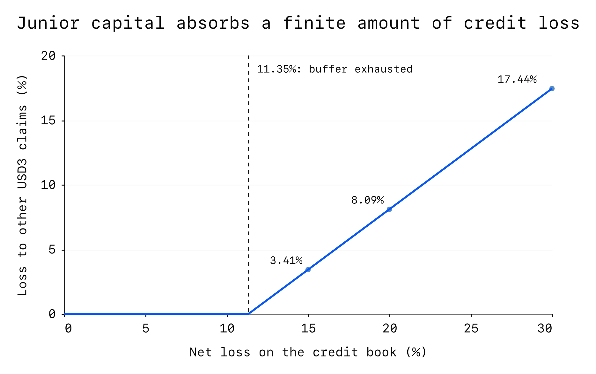

---
{
  "title": "Asset Review: 3Jane USD3",
  "description": "USD3 is the senior share of 3Jane’s pooled lending strategy. Depositors supply USDC and receive USD3 shares, which earn income from loans and Aave deposits. A junior tranche, sUSD3, receives part of the profits in exchange for absorbing losses before other USD3 holders.",
  "publishedAt": "2026-09-08",
  "tokenLogo": "../../assets/reports/usd3-ethereum/figures/token-logo.svg",
  "draft": false,
  "reviewedBy": [
    "Wavey"
  ]
}
---

# Asset Review:  3Jane USD3

| Item | Detail |
| --- | --- |
| Asset |  3Jane USD3 |
| Asset type | Senior lending-vault share |
| Deployment | Ethereum ([0x056B…5eCc](https://etherscan.io/address/0x056B269Eb1f75477a8666ae8C7fE01b64dD55eCc)) |
| Review date | 14 September 2026 |

- [Overview](#overview)
- [Issuer and organization](#issuer-and-organization)
- [Mechanics and dependencies](#mechanics-and-dependencies)
- [Governance and control](#governance-and-control)
- [Exits and market liquidity](#exits-and-market-liquidity)
- [Valuation and oracle considerations](#valuation-and-oracle-considerations)
- [Security and operational history](#security-and-operational-history)
- [Collateral considerations](#collateral-considerations)

## Overview

USD3 is the senior share of 3Jane’s pooled lending strategy. Depositors supply USDC and receive USD3 shares, which earn income from loans and Aave deposits.[^suppliers][^usd3-code] A junior tranche, sUSD3, receives part of the profits in exchange for absorbing losses before other USD3 holders.[^usd3-code][^susd3-code]

The vault reports 80.02 million USDC of assets against 67.99 million USD3 shares, equivalent to approximately 1.1769 USDC per share.[^snapshot] Credit accounts for 84.5% of reported assets; the rest supports native withdrawals.[^snapshot] The junior tranche’s 7.66 million USDC claim is included in these totals.[^snapshot]

- **Concentrated credit and uncertain recovery rights.** Loans purchased from Slope account for about 71% of reported assets.[^snapshot][^facilities-data] Public disclosures describe ownership and collection arrangements, but independent loan verification and signed recovery agreements were unavailable.[^fcc-legal]
- **A finite first-loss buffer.** With current holdings fixed, junior capital and locked profit absorb net losses of roughly 11.35% of the credit book before other USD3 holders lose value.[^credit-sensitivity] This protection depends on losses being recognized and does not replace unpaid loans with cash.
- **Exits become costly at larger sizes.** Native withdrawals can draw on approximately 12.40 million USDC, or 15.5% of reported assets.[^snapshot] Secondary liquidity is much thinner: simulated sales of two million and five million USD3 returned about 11.7% and 64.6% below reported share value.[^final-exits]
- **Losses can temporarily block withdrawals.** Credit losses can remain outside the reported share value until 3Jane updates the accounts.[^credit-code][^borrower-census] Once a loss is detected, withdrawals stop pending reporting; the current automated reporter rejects losses, requiring management to intervene.[^keeper-code][^loss-tests]

## Issuer and organization

3Jane was founded by Jacob Chudnovsky and raised a reported $5.2 million seed round led by Paradigm in June 2025.[^founder] Its website terms identify Tulkum Assets Corp., a Panamanian company, as the operator.[^organization]

### Lending partners and exposures

Slope lends to small and medium-sized businesses. 3Jane’s 10 September facility report lists $56.75 million deployed across 1,580 purchased loans, with Slope administering the loans and collecting repayments.[^facilities-data][^fcc-legal]

The report classifies 96.2% of balances as up to date on payments, 1.2% as at least 30 days late and none as written off.[^facility-quality] About 79% of collateral comes from July–September originations, leaving little repayment history through a prolonged downturn.[^facility-quality] The portfolio is paying down, with a weighted remaining term of 46 days.[^facilities-data] Its $56.23 million collateral balance is approximately $523,000 below deployed principal, a difference the public breakdown does not reconcile.[^facility-quality]

LendSwift lends to U.S. consumers. 3Jane’s facility provides up to $10 million at 15% annual interest, financing up to 75% of eligible loan value while LendSwift contributes 25% and bears losses first.[^fcc-legal] That equity protects this facility, not the Slope loans, whose reported advance rate is 100%.[^facilities-data][^fcc-legal] LendSwift can reuse repayments to finance new loans until 26 May 2027; full repayment is due by 26 November 2027.[^fcc-legal] Short borrower terms therefore do not make 3Jane’s funding immediately recoverable.

The 11 September facility report covers 21,303 loans and $5.71 million of principal funded by 3Jane. About 38.4% of the gross loan balance is at least 16 days late, with a weighted borrower APR of approximately 693%.[^facility-quality] After deductions for delinquency and payment shortfalls, and including collection cash, reported net collateral is $8.26 million against $5.79 million of senior obligations.[^facility-quality] The resulting 43% excess collateral exceeds the required 33%.[^facility-quality] This provides meaningful protection if the loans and cash are worth their reported amounts; eventual losses depend on collections.

Thousands of underlying loans still depend on a small number of originators and servicers.[^facilities-data][^fcc-legal]

### Collections and legal protections

3Jane describes special-purpose vehicles separating facility assets from the originator and sponsor, together with controlled collection accounts.[^fcc-legal] Erebor Bank handles conversion, facility wires and collections before funds return onchain.[^erebor] The $3.08 million listed as bank cash remains an operator disclosure, with its balance and segregation unverified; it is unavailable for direct Ethereum withdrawals.[^snapshot][^facilities-data]

The central uncertainty is who can enforce the loan rights and return recoveries to USD3 if an originator, servicer or operator fails. Signed ownership, security and account-control agreements were unavailable, leaving creditor priority unverified.[^fcc-legal] The disclosures also name no backup servicer or timetable for taking over collections.[^facilities-data] An older, unsigned crypto-credit agreement does not establish the terms governing today’s accounts.[^advance] These protections may exist, but the available documents are insufficient to verify them.

## Mechanics and dependencies

### How funds reach borrowers

The strategy deposits USDC into Aave through waUSDC, then supplies that wrapper token to MorphoCredit.[^usd3-code] Unborrowed waUSDC can be converted back into USDC. Borrowed funds become credit claims: MorphoCredit holds no borrower collateral for an ordinary onchain liquidation, so recovery relies on repayment or offchain enforcement.[^fcc-legal][^credit-code]

Of approximately 67.64 million USDC recorded as credit, 97.4% of debt shares belong to a staging account controlled by 3Jane’s main governance wallet.[^snapshot][^borrower-census] The app attributes most of that funding to fintech facilities and bank cash.[^facilities-data] Those separately dated balances describe uses of the credit position; adding them again would overstate backing.

The strategy may lend up to 100% of available waUSDC, with the separate limit tied to junior backing disabled.[^usd3-code][^snapshot] The contract also does not verify how junior holdings were funded, including whether borrowed funds contributed to them.[^usd3-code][^guardian-audit]

### Income and loss protection

When the strategy reports a profit, 7.5% is allocated to sUSD3 through newly issued shares; the remainder raises USD3’s share value over three days.[^usd3-code][^snapshot] Interest can enter reported value before borrowers pay it. Separate JANE rewards are currently non-transferable and cannot be spent as USDC income.[^jane-incentives][^jane-state]

The junior buffer consists of USD3 shares held by sUSD3. Reported losses first consume locked profit, then burn those shares, making junior holders absorb the loss without replenishing the vault’s USDC.[^usd3-code][^susd3-code] The junior claim is worth about 7.66 million USDC, with roughly $15,700 of profit still locked.[^snapshot] Figure 1 shows how losses beyond that buffer reduce other holders’ claims.

*Figure 1. Junior capital absorbs the first losses, then other USD3 holders share the remainder. Source: original calculations from pool accounting, assuming immediate recognition and fixed holdings.*[^credit-sensitivity]

These scenarios assume no new income, deposits or exits. Credit losses are net of facility-level recoveries, and discretionary insurance is excluded.

Ordinary junior withdrawals require a 30-day wait and must leave at least $7.5 million of backing; only about $161,000 is currently above that floor.[^susd3-code][^snapshot] A junior shutdown waives both restrictions while retaining checks for unreported losses.[^susd3-code]

A separate InsuranceFund holds waUSDC worth approximately 1.03 million USDC. Credit managers choose whether to use it during settlement; holders have no automatic claim on it.[^insurance] Its value also depends on the Aave redemption path.

### Loss recognition and withdrawal access

All 16 accounts with debt have zero amounts due in the onchain obligation record and scheduled loan-value reductions, called markdowns, switched off.[^borrower-census] Credit deterioration can therefore remain outside USD3’s reported value until 3Jane updates the accounts or settles the debt.[^credit-code] Ordinary USD3 reports do not update individual borrower premiums or markdowns.[^usd3-code][^credit-code]

Once the strategy detects a loss, it blocks withdrawals until that loss is reported.[^usd3-code] This prevents redemption against stale values, but cannot catch losses missing from the underlying loan accounts. The automated reporter updates both tranches together, yet its health checks reject every loss report.[^keeper-code] Management must change the check or report directly before withdrawals can resume.[^usd3-code][^susd3-code]

A simulated write-off of a smaller borrower illustrates the sequence: withdrawals stopped, management reported the loss, junior shares absorbed it, and withdrawals resumed without materially changing USD3’s share value.[^loss-tests] This assumes management has the required authority and any timelock delay has passed; it does not establish how quickly management would act.

### Token behavior and restrictions

USD3 supports ordinary transfers and approvals, with no current deposit commitment lock.[^usd3-code][^snapshot] Management can introduce a period restricting depositor transfers, with exemptions for transfers to or from sUSD3.[^usd3-code] Deposit eligibility is configurable, and borrowers with outstanding debt shares are excluded.[^usd3-code]

Circle can pause USDC or blacklist addresses; Aave authorities can pause waUSDC or the USDC reserve and interrupt native withdrawals.[^usdc-controls][^underlying-controls] A reserve deposit freeze alone does not block withdrawals.[^underlying-controls] These upgradeable dependencies can interrupt exits even while USD3 remains transferable.

## Governance and control

A single 3-of-5 Safe controls parameter proposals through a one-day timelock and core upgrades through a seven-day timelock.[^control] The staging account is owned by that same Safe.[^borrower-census] The threshold is verified; the signers’ identities and independence are not.

Management can change credit limits, repayment obligations, fees, deposit restrictions and junior protection settings.[^usd3-code][^susd3-code][^credit-code] Upgrades can change the strategy’s behavior after the longer delay.[^control] Existing restrictions therefore depend partly on continued governance policy.

An emergency controller can immediately pause borrowing and new market supply, reduce selected limits to zero and revoke credit limits.[^emergency-code] Its powers stop short of issuing new credit or settling arbitrary loans; restoring parameters requires the ordinary owner path.[^emergency-code] Restricting activity can be faster than recognizing losses and reopening withdrawals.

## Exits and market liquidity

### Native withdrawals

Native redemption burns USD3 and returns USDC from unborrowed waUSDC in MorphoCredit, subject to Aave’s available liquidity.[^usd3-code] Approximately 12.40 million USDC is available, a shared reserve that successive withdrawals consume.[^snapshot][^final-exits] Once it is used, further withdrawals depend on repayments or new funding.

The default redeem function permits losses unless the caller sets a limit; the default withdraw function permits none.[^strategy-code] Strategy shutdown also retains the unreported-loss withdrawal check.[^usd3-code]

### Secondary-market liquidity

The main Curve pool holds about 2.08 million frxUSD against 245,000 USD3.[^secondary-exits] Selling USD3 receives frxUSD, which still needs conversion to USDC. The direct Frax custodian holds only about 974 USDC, insufficient to redeem proceeds from the tested sales.[^secondary-exits] A route through Curve’s frxUSD/crvUSD and crvUSD/USDC pools completed the conversion:

| USD3 sold (m) | USDC received | vs. share value |
| ---: | ---: | ---: |
| 0.1 | 118,264 | +0.48% |
| 1 | 1,177,388 | +0.04% |
| 2 | 2,078,520 | −11.70% |
| 5 | 2,080,552 | −64.64% |

*Simulated proceeds include pool fees and exclude gas. Each size starts independently, with no competing trades or adverse price moves between swaps. The seller is assumed to hold USD3; integration withdrawals and liquidations are not modeled.*[^final-exits][^secondary-exits]

Selling five million USD3 returns almost the same USDC as selling two million because the first pool has little frxUSD left to pay out. The route also depends on frxUSD’s transfer and freezing controls and liquidity in two additional pools.[^secondary-exits][^frxusd-controls]

About 96.6% of the first pool’s LP tokens sit in Convex and Stake DAO custody contracts that aggregate users.[^curve-lp] Stake DAO represents 32.6% of pool LP, including its position through Convex; the largest individual Convex account represents 14.5%.[^curve-lp] The accounts’ ultimate ownership is unverified. Staking has no maturity lock, so reduced incentives or simultaneous LP withdrawals can remove depth when sellers need it.[^curve-lp]

### Liquidity over time

Cash available for native withdrawals rose from 4.6% of reported assets on 6 June to 31.5% on 12 June.[^exit-history] On 6 June, the three-pool quote for one million USD3 was only about 50,400 USDC, a 95.6% discount, because the first pool held roughly that amount of frxUSD.[^exit-history] By July, that sale size quoted within 1% of reported value.[^exit-history] The sale figures are historical quotes; liquidity may have been worse between those dates.

### Pendle and Morpho holdings

Pendle’s wrapper holds 48.5% of USD3 supply, and Morpho Blue holds 21.2%.[^holders] These contracts aggregate users whose simultaneous exits could compete for the same cash.

Before Pendle’s 17 December 2026 maturity, holders can sell principal tokens (PT) or redeem matching principal and yield tokens for the standardized-yield wrapper (SY). Afterward, PT alone can redeem for SY.[^pendle-exits] SY returns USD3 one-for-one or uses its native USDC withdrawal path.[^pendle-exits] Maturity neither supplies separate cash nor compensates holders for a USD3 loss. Pendle’s separate 3-of-5 Safe can upgrade the wrapper, and pausing it can interrupt access.[^pendle-exits]

### Callable capital

3Jane’s Liquidity Commitment Contracts have approximately 7.58 million USDC of active commitments and 1.33 million pending activation, backed by a 7.5% initial margin requirement. Neither facility has received call funding, so these promises currently provide no USDC for withdrawals.[^lcc-state]

The next ordinary call window begins on 28 September, with a nine-day funding window from 30 September, assuming unchanged settings and no pause.[^lcc-state][^lcc-code] Opening a call requires the one-day timelock. Failure to fund exposes a participant’s margin to an auction intended to attract replacement funding.[^lcc-code]

Funders must deposit into USD3 and receive wrapped shares with a 35-day withdrawal cooldown and exposure to USD3’s value.[^lcc-code][^notification-state] Reported assets have reached the 80 million USDC deposit cap, blocking this funding path until capacity is restored.[^usd3-code][^snapshot][^lcc-state] Credit stress may also make participants less willing to fund when withdrawals increase.

## Valuation and oracle considerations

USD3’s reported share value comes from the vault’s accounts.[^usd3-code][^credit-code] Unpaid interest and delayed loss recognition can leave it above recoverable value.

The Morpho Blue USD3/USDC market uses an immutable oracle that reads USD3’s USDC share conversion, with no external price feeds enabled.[^blue-oracle] A secondary-market discount therefore does not lower collateral valuation. A reported credit loss can lower it later, when exits are already constrained.

The market holds 14.44 million USD3 against approximately 14.73 million USDC of debt, with a liquidation threshold of 91.5% of oracle collateral value.[^blue-positions] All positions are currently below that threshold. Holding positions and debt fixed, a 1% oracle decline would make two positions owing 2.02 million USDC eligible for liquidation; a 5% decline would affect 18 positions owing 7.51 million USDC.[^blue-positions] These figures describe debts in affected positions, not amounts necessarily liquidated or sold. Recoveries depend on the liquidity available when collateral is sold or redeemed.

Both native payouts and this market’s debt are USDC-denominated. A USDC depeg changes their dollar value even where their relative USDC valuation is unchanged.

## Security and operational history

USD3 changed its accounting unit from waUSDC to USDC in October 2025, producing a jump in quoted share value unrelated to yield.[^operating-history] The vault shut down on 19 April 2026 and restarted after an upgrade on 1 May, with reported share value unchanged across those boundaries.[^operating-history] During the interval, 82 withdrawals returned approximately 2.32 million USDC.[^shutdown-withdrawals] The shutdown’s cause remains unclear, and successful withdrawals do not establish uninterrupted access.

A small legacy borrower entered default in September 2025. An update setting its payment obligation to zero restored its “current” status before the debt was subsequently repaid.[^legacy-default] No realized USD3 loss was established. The status reset shows why repayment labels alone cannot establish credit quality.

### Audit history

| Date | Audit |
| --- | --- |
| Aug 2025 | [Veridise](https://github.com/3jane-protocol/audits/blob/689fcc30e2c7b615d4f8c92d86b06b0d9b53056f/veridise-audit.pdf) |
| Aug 2025 | [Sherlock](https://github.com/3jane-protocol/audits/blob/689fcc30e2c7b615d4f8c92d86b06b0d9b53056f/sherlock-audit.pdf) |
| Oct 2025 | [Electisec](https://github.com/3jane-protocol/audits/blob/689fcc30e2c7b615d4f8c92d86b06b0d9b53056f/electisec-audit.pdf), [updated November report](https://reports.yaudit.dev/pdf/2025-10-3Jane-Moneymarket-report.pdf) |
| Oct 2025 | [Sherlock — preliminary](https://github.com/3jane-protocol/audits/blob/689fcc30e2c7b615d4f8c92d86b06b0d9b53056f/sherlock-2-audit.pdf) |
| May 2026 | [Electisec — USD3/sUSD3 update](https://github.com/3jane-protocol/audits/blob/689fcc30e2c7b615d4f8c92d86b06b0d9b53056f/yaudit-usd3-susd3-may-2026-audit.pdf) |
| Aug 2026 | [Guardian — callable capital](https://github.com/3jane-protocol/audits/blob/689fcc30e2c7b615d4f8c92d86b06b0d9b53056f/guardian-lcc-august-2026-audit.pdf) |

Electisec’s updated November report removes the high-severity Pendle yield finding after the affected functionality was removed.[^electisec-oct-audit]

The deployed tranche files match the May 2026 review’s final revision, but stale premium and markdown accounting were accepted with operational mitigations.[^audit-match][^may-audit] One assumed at least seven days of profit unlocking; the live setting is three days.[^snapshot][^may-audit]

Guardian’s reviewed LCC sources match the deployment, while core credit and tranche contracts differ.[^audit-match] Later fixes allowing LCC funding through the deposit cap and during a pause are absent, leaving the funding obstacle described above.[^usd3-code][^audit-match] These contract audits do not verify the receivables or legal recovery arrangements.

## Collateral considerations

USD3’s junior buffer can protect holders from modest recognized losses, while payment delays can constrain withdrawals before that protection is exhausted. Recovery ultimately depends on concentrated offchain credit and the legal arrangements described above.

Morpho’s oracle can leave borrowers apparently healthy during a market discount, then expose them to liquidation when losses enter the accounts. Lenders and liquidators depend on USDC recoverable within the repayment window. The sale-size results show how sharply that value can fall; callable capital offers later, conditional support.

[^suppliers]: 3Jane, [Suppliers](https://docs.3jane.xyz/usd3-susd3/suppliers.md), retrieved 14 September 2026; issuer description.

[^usd3-code]: 3Jane, [USD3 deployed implementation source](https://etherscan.io/address/0xB606fB370Eaaad03d71B49aE5E42AA4aEC7458D9#code), resolved against the Ethereum deployment on 14 September 2026.

[^susd3-code]: 3Jane, [sUSD3 deployed implementation source](https://etherscan.io/address/0x529cbf11fFbC272D63858ca40A2C7F2695712073#code), including cooldown, backing floor and shutdown behavior.

[^snapshot]: Original Ethereum reads and calculations, 14 September 2026, of [USD3](https://etherscan.io/address/0x056B269Eb1f75477a8666ae8C7fE01b64dD55eCc), [MorphoCredit](https://etherscan.io/address/0xDe6e08ac208088cc62812Ba30608D852c6B0EcBc) and their dependencies. Quantities distinguish stored accounting, simulated accrual and withdrawal limits; explorer links identify contracts, while exact historical contract data and calculations are retained in the accompanying research record.

[^facilities-data]: 3Jane, [Fintech facilities and backing app](https://app.3jane.xyz/info/pulls/fcc), retrieved 14 September 2026. Slope report dated 10 September and LendSwift report dated 11 September; operator-reported receivables and cash, not independent reserve assurance.

[^fcc-legal]: 3Jane, [LendSwift warehouse announcement](https://www.3jane.xyz/reports/3jane-x-lendswift-senior-warehouse-facility), 29 May 2026; [Slope purchase announcement](https://www.3jane.xyz/reports/3jane-x-slope-whole-loan-sale), 8 June 2026. These are transaction-party disclosures.

[^credit-sensitivity]: Original static loss sensitivity from the same Ethereum accounting inputs as the pool snapshot, 14 September 2026. Calculation inputs, assumptions and figure recipe are retained in the research record; [USD3 loss-allocation implementation](https://etherscan.io/address/0xB606fB370Eaaad03d71B49aE5E42AA4aEC7458D9#code).

[^final-exits]: Original isolated Ethereum exit tests and calculations at block 25,977,214, extending the review’s existing USD3→frxUSD→crvUSD→USDC route to two million and five million USD3 and testing native withdrawals around the available limit. The larger scenarios consolidate existing shares by impersonation; backing and exit-pool reserves remain unchanged. Setup, quotes, measured proceeds, revert traces and calculations are retained in the research record. [USD3](https://etherscan.io/address/0x056B269Eb1f75477a8666ae8C7fE01b64dD55eCc#code); [USD3/frxUSD pool](https://etherscan.io/address/0x7BA89Bc658c07569cfa6d7947adAA80181a24568#code).

[^credit-code]: 3Jane, [MorphoCredit deployed implementation](https://etherscan.io/address/0xb326c390a607b4317A1D205dfF4aFb1A42CA7157#code) and [CreditLine](https://etherscan.io/address/0x26389b03298BA5DA0664FfD6bF78cF3A7820c6A9#code).

[^borrower-census]: Original pinned census of all 76 credit-line event candidates at [MorphoCredit](https://etherscan.io/address/0xDe6e08ac208088cc62812Ba30608D852c6B0EcBc), reconciled against market debt shares, and reads of [the principal borrower Safe](https://etherscan.io/address/0x3Ff3ff33D20a086834A095ed6ed562c9e189291b) and [governance Safe](https://etherscan.io/address/0x33333333Bd7045F1A601A1E289D7AB21036fB5EF), 14 September 2026.

[^keeper-code]: 3Jane, [KeeperRelayer deployed source](https://etherscan.io/address/0xc22158100b823e1ef612fba265941efe9e7d7975#code), and original reads of both health-check configurations on 14 September 2026.

[^loss-tests]: Original isolated Ethereum fork tests at the review snapshot, using deployed [CreditLine settlement](https://etherscan.io/address/0x26389b03298BA5DA0664FfD6bF78cF3A7820c6A9#code), [USD3 reporting](https://etherscan.io/address/0xB606fB370Eaaad03d71B49aE5E42AA4aEC7458D9#code) and [KeeperRelayer](https://etherscan.io/address/0xc22158100b823e1ef612fba265941efe9e7d7975#code). Existing management authority was impersonated to abstract governance scheduling; no loan recovery or token backing was fabricated. Traces and exact accounting changes are retained in the research record.

[^founder]: RT Watson, The Block, [Paradigm leads $5.2 million seed round in 3Jane](https://www.theblock.co/news/deals/2025-06-04-paradigm-leads-5-million-seed-round-in-crypto-credit-startup-3jane-356872), 4 June 2025, including an interview with founder Jacob Chudnovsky. Historical funding is not a reserve attestation.

[^organization]: 3Jane, [Terms of service](https://www.3jane.xyz/pdf/terms-of-service.pdf), revised 1 September 2025.

[^facility-quality]: Original calculations from 3Jane’s [public facility reports](https://app.3jane.xyz/info/pulls/fcc), Slope dated 10 September and LendSwift dated 11 September 2026. LendSwift delinquency amounts reconcile to its gross collateral balance; net collateral reconciles after disclosed haircuts and collection cash. Slope vintage amounts are rounded in the source. These checks reconcile operator disclosures, without independently verifying the underlying loans or bank accounts.

[^erebor]: 3Jane, [Erebor facility funding](https://www.3jane.xyz/reports/3jane-x-erebor-fintech-facility-funding), 19 May 2026; issuer description of funding and collections.

[^advance]: Tulkum Assets Corp., [3Jane Advance Agreement](https://www.3jane.xyz/pdf/advance.pdf), public undated form.

[^guardian-audit]: Guardian, [3Jane LCC review](https://github.com/3jane-protocol/audits/blob/689fcc30e2c7b615d4f8c92d86b06b0d9b53056f/guardian-lcc-august-2026-audit.pdf), 27 August 2026; severity counts and remediation statuses are the auditor’s classifications.

[^jane-incentives]: 3Jane, [JANE liquidity mining](https://docs.3jane.xyz/jane/liquidity-mining.md), retrieved 14 September 2026; issuer description of locked-token rewards.

[^jane-state]: Original pinned transferability and role reads of [JANE](https://etherscan.io/address/0x333333330522f64ee8d0b3039c460b41670e3404#code), 14 September 2026.

[^insurance]: Original pinned balance and conversion reads of [InsuranceFund](https://etherscan.io/address/0x4507B5B23340D248457d955a211C8B0634D29935#code) and the [CreditLine settlement path](https://etherscan.io/address/0x26389b03298BA5DA0664FfD6bF78cF3A7820c6A9#code), 14 September 2026.

[^usdc-controls]: Circle, [deployed USDC implementation](https://etherscan.io/address/0x43506849D7C04F9138D1A2050bbF3A0c054402dd#code), including pause and blacklist controls; resolved at the review snapshot.

[^underlying-controls]: Deployed [USDC implementation](https://etherscan.io/address/0x43506849D7C04F9138D1A2050bbF3A0c054402dd#code), [waUSDC](https://etherscan.io/address/0xD4fa2D31b7968E448877f69A96DE69f5de8cD23E#code), [Aave Pool implementation and validation logic](https://etherscan.io/address/0x728a138A4823392C2EFA55e028d434F526fE03CF#code), [aEthUSDC implementation](https://etherscan.io/address/0xadC45Df3cf1584624C97338BEF33363BF5b97AdA#code) and [Aave addresses provider](https://etherscan.io/address/0x2f39d218133afab8f2b819b1066c7e434ad94e9e#code), resolved at the review snapshot.

[^control]: Original Ethereum configuration reads, 14 September 2026; [parameter timelock](https://etherscan.io/address/0x1dCcD4628d48a50C1A7adEA3848bcC869f08f8C2#code), [upgrade timelock](https://etherscan.io/address/0x3D3C41419Ab401cd25055E8f9421D7D96d887885#code) and linked proxy administrators. Historical calls are retained in the research record.

[^emergency-code]: 3Jane, [EmergencyController](https://etherscan.io/address/0x84b31b84917485e221305edf590b8e3660d2e051#code) and [ProtocolConfig implementation](https://etherscan.io/address/0x64Bc68ea388e42c73747668122eee3A5bfB70b98#code).

[^strategy-code]: Yearn, [TokenizedStrategy 3.0.4 deployed source](https://etherscan.io/address/0xD377919FA87120584B21279a491F82D5265A139c#code), used by the two 3Jane strategies.

[^secondary-exits]: Original Ethereum reads and isolated full-route execution tests, 14 September 2026: [USD3/frxUSD](https://etherscan.io/address/0x7BA89Bc658c07569cfa6d7947adAA80181a24568#code), [frxUSD/crvUSD](https://etherscan.io/address/0x13e12BB0E6A2f1A3d6901a59a9d585e89A6243e1#code), [crvUSD/USDC](https://etherscan.io/address/0x4DEcE678ceceb27446b35C672dC7d61F30bAD69E#code) and [Frax USDC custodian](https://etherscan.io/address/0x4F95C5bA0C7c69FB2f9340E190cCeE890B3bd87c#code). Pin, quotes, failed custodian redemptions, successful ordered swaps and measured balance changes are retained locally.

[^frxusd-controls]: Frax, [deployed frxUSD implementation](https://etherscan.io/address/0x0000000048D2c8baf31742f6765383278BAda4d5#code), including transfer, pause and freezing behavior; resolved at the review snapshot.

[^curve-lp]: Original complete transfer-derived LP and gauge-holder censuses, reconciled to supply at the review block, and [USD3/frxUSD gauge source](https://etherscan.io/address/0xe73d3f4e660830e7ed4650f881fd7e55350f66f9#code). Pinned control wiring links the [largest voter proxy](https://etherscan.io/address/0x989AEb4d175e16225E39E87d0D97A3360524AD80#code) to Convex’s booster and the [second voter contract](https://etherscan.io/address/0x52f541764E6e90eeBc5c21Ff570De0e2D63766B6#code) to a Safe whose enabled [Curve strategy module](https://etherscan.io/address/0xb010c392f9572aeb5ea3817e94dc6745421b2bb5#code) identifies Stake DAO and routes authorized LP withdrawals through the voter contract. Figures measure LP custody at one block, not beneficial-owner concentration or committed future liquidity.

[^exit-history]: Original archived Ethereum reads at eight selected blocks from 6 June to 3 September 2026, comparing [USD3](https://etherscan.io/address/0x056B269Eb1f75477a8666ae8C7fE01b64dD55eCc) native limits and the three-pool Curve route with contemporaneous stored accounting. Exact block hashes, complete route quotes and reproducible calculations are retained in the research record; fees included and gas excluded.

[^holders]: Original transfer-derived census and pinned reads of the largest 20 holders, representing 94.16% of supply; [Pendle SY](https://etherscan.io/address/0xeA3BC608F32847B97965C5e1648BDFCd4C2C40d0#code) and [Morpho Blue](https://etherscan.io/address/0xBBBBBbbBBb9cC5e90e3b3Af64bdAF62C37EEFFCb#code).

[^pendle-exits]: Original pinned configuration and deployed-source analysis of [USD3 SY](https://etherscan.io/address/0xeA3BC608F32847B97965C5e1648BDFCd4C2C40d0#code), [PT](https://etherscan.io/address/0x7f47c3e6b2c00fc4eb4d5ae50d0ab0ab6888eb4d#code), [YT](https://etherscan.io/address/0x5cFfCc9DdEF0fDcf395e2eA24CA5ED5A12032706#code), [PT/SY market](https://etherscan.io/address/0x4a5067c3ff1abb7449244025b0e37feaf77d8e3e#code), and [Pendle administrative Safe](https://etherscan.io/address/0x8119EC16F0573B7dAc7C0CB94EB504FB32456ee1#code).

[^lcc-state]: Original Ethereum configuration, balance and complete facility-event reads, 14 September 2026; [USDC-margin facility](https://etherscan.io/address/0x8350ba7c69aeADD74b891EFc53F52a0f592aD796#code), [USDT-margin facility](https://etherscan.io/address/0xF4ae98CD6ef156aD87C1f004BBF0cdaB6442042f#code) and [factory](https://etherscan.io/address/0x95431c2Fbfe3E0f17a61EF1d7601Eb34aE6cd6ba#code). Future dates are calculated from their current clocks.

[^lcc-code]: 3Jane, [LCC implementation and linked libraries](https://etherscan.io/address/0xf543F3C822b48f833f27e6c41F344012362F1627#code), including call timing, funding delivery, slashing and auctions; [USD3 deposit-cap implementation](https://etherscan.io/address/0xB606fB370Eaaad03d71B49aE5E42AA4aEC7458D9#code).

[^notification-state]: Original pinned configuration of the [USD3 NotificationVault](https://etherscan.io/address/0xDF697c55f0D696CA9E3E624cD52d8186C6745904#code) and its [deployed implementation](https://etherscan.io/address/0x4f9ab9c35a9001C5aBbFc4de601560798CbD5807#code), 14 September 2026.

[^blue-oracle]: [Deployed USD3/USDC oracle](https://etherscan.io/address/0x68b4c2b2b2e245ab54a3bd55dfd5a9d84f029c06#code), complete source and immutable inputs checked at block 25,977,214; market `0xe3df58f9d3011b7481ff36b939fa5f8da642f34ea5792d25d3958dbf1efa26d7`.

[^blue-positions]: Original complete event-derived position census and pinned debt-accrual calculation for the [Morpho Blue USD3/USDC market](https://app.morpho.org/ethereum/market/0xe3df58f9d3011b7481ff36b939fa5f8da642f34ea5792d25d3958dbf1efa26d7/usd3-usdc), 14 September 2026. Instant valuation sensitivities hold positions and debt fixed and do not simulate liquidation execution.

[^operating-history]: Original historical state and transaction reconstruction. The [USD3 upgrade history](https://etherscan.io/address/0x056B269Eb1f75477a8666ae8C7fE01b64dD55eCc#events) identifies deployment changes; the [22 April 2026 shutdown withdrawal](https://etherscan.io/tx/0xc74df54b1ec6b906e4a6a912e8e6b08ac5a7a5c1587e7b03c3f38a151a0fe878) and historical implementation source establish the recovery of idle USDC. Values before and after these changes come from saved historical contract reads; explorer links identify the contracts and transactions.

[^shutdown-withdrawals]: Original calculation from the complete saved USD3 event history: 82 Withdraw events totaling 2,319,662.522112 USDC strictly between the [19 April shutdown](https://etherscan.io/tx/0x4c1611d4cad8436f243122a7c30042253c0dacc12995554d825f3a81ef1aab87) and [1 May restart](https://etherscan.io/tx/0x3aaf4b1ed755a946c7b3e9bebd2f6d657f78e50490a629f81b40a6dd974aa9af). The total is derived from intervening events, not either transition transaction; successful withdrawals do not establish uninterrupted access.

[^legacy-default]: Original historical implementation, event and pinned-position reconstruction for [the legacy borrower](https://etherscan.io/address/0x93Bd63B173E21806a7478150c4090626c9b56a98). See the [default event transaction](https://etherscan.io/tx/0xfff1acb386d62941a2c0cba3deaeb7f0afd1690796d491c690a3455d2bcd95ca), [zero-obligation posting](https://etherscan.io/tx/0x51717ef63d5f1058b14d5ef1c6c9b8b14f7ac1d0e8dd4cf3e57744c3065213d0) and [remaining-debt repayment](https://etherscan.io/tx/0x1c74963bbbe2aa84aa58404cd209c00d2c4a3dc357f335f6fa37d87331eba8c5). The contract's default classification is distinct from a realized loss to USD3.

[^electisec-oct-audit]: Electisec, [original report](https://github.com/3jane-protocol/audits/blob/689fcc30e2c7b615d4f8c92d86b06b0d9b53056f/electisec-audit.pdf), 18 October 2025; yAudit, [updated report](https://reports.yaudit.dev/pdf/2025-10-3Jane-Moneymarket-report.pdf), 25 November 2025. Both versions are retained in the research record.

[^audit-match]: Original source comparisons against the [May final revision](https://github.com/3jane-protocol/moneymarket-contracts/tree/52bf5322f53ed2e59fa31c994f76d4253d9b9172) and [Guardian’s stated remediation revision](https://github.com/3jane-protocol/moneymarket-contracts/tree/74353c0564755da516c2bd7892fbbfeede38e082), using deployment sources resolved on 14 September 2026. Source matches do not constitute independent bytecode recompilation or certification of every remediation status.

[^may-audit]: Electisec, [3Jane USD3/sUSD3 update review](https://github.com/3jane-protocol/audits/blob/689fcc30e2c7b615d4f8c92d86b06b0d9b53056f/yaudit-usd3-susd3-may-2026-audit.pdf), completed 28 May 2026, findings 2.5–2.7 and developer responses.
