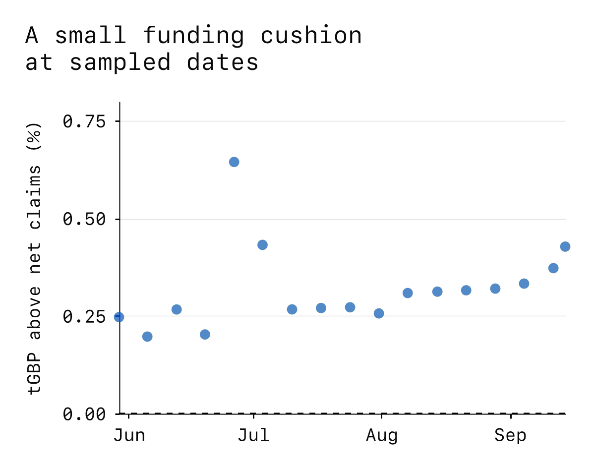
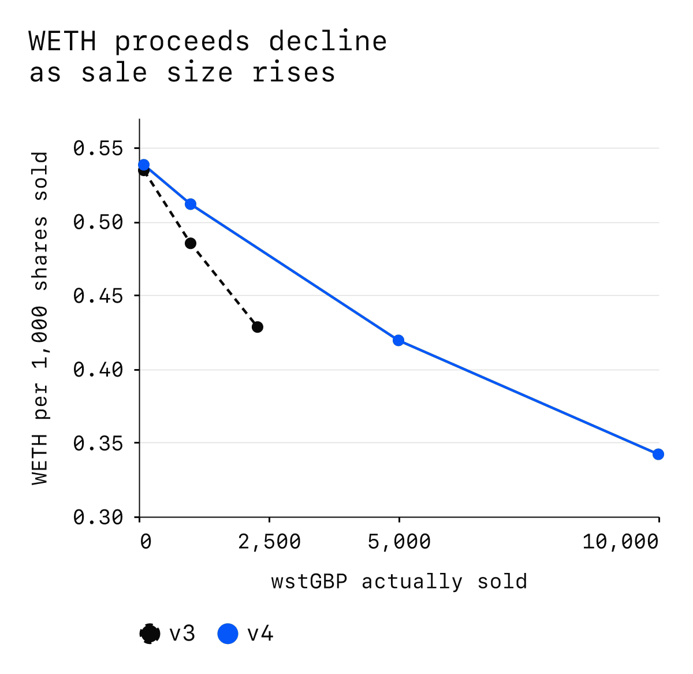

---
{
  "title": "Asset Review: Wren Staked tGBP",
  "description": "wstGBP gives holders exposure to tokenised sterling through tGBP and an operator-published conversion rate. Depositing tGBP creates shares; redeeming shares creates a claim payable in tGBP. The website attributes rate growth to a commercial agreement with tGBP issuer BCP Technologies, but the binding protocol terms describe discretionary awards from the programme operator’s corporate funds and deny that holders receive reserve income. The token balance does not rebase, and “staked” does not mean validator staking. The rate is discretionary rather than a contractual promise of income.",
  "publishedAt": "2026-09-08",
  "tokenLogo": "../../assets/reports/wstgbp-ethereum/figures/token-logo.svg",
  "draft": false,
  "reviewedBy": [
    "Wavey"
  ]
}
---

# Asset Review:  Wren Staked tGBP

| Item | Detail |
| --- | --- |
| Asset |  Wren Staked tGBP |
| Asset type | Sterling wrapper with rewards |
| Deployment | Ethereum ([0x57C3…B7aE](https://etherscan.io/token/0x57C3571f10767E49C9d7b60feb6c67804783B7aE)) |
| Review date | 14 September 2026 |

- [Overview](#overview)
- [Issuer and organization](#issuer-and-organization)
- [Mechanics and dependencies](#mechanics-and-dependencies)
- [Governance and control](#governance-and-control)
- [Exits and market liquidity](#exits-and-market-liquidity)
- [Valuation and oracle considerations](#valuation-and-oracle-considerations)
- [Security and operational history](#security-and-operational-history)
- [Collateral considerations](#collateral-considerations)
- [Open questions](#open-questions)

## Overview

wstGBP gives holders exposure to tokenised sterling through tGBP and an operator-published conversion rate. Depositing tGBP creates shares; redeeming shares creates a claim payable in tGBP. The website attributes rate growth to a commercial agreement with tGBP issuer BCP Technologies, but the binding protocol terms describe discretionary awards from the programme operator’s corporate funds and deny that holders receive reserve income. The token balance does not rebase, and “staked” does not mean validator staking. The rate is discretionary rather than a contractual promise of income.[^architecture][^interface][^protocol]

Outstanding supply is 68,059 wstGBP, representing 68,835 tGBP at the published NAV and 68,663 tGBP after the 0.25% redemption fee. The wrapper holds 68,957 tGBP with no pending claims, covering 100.43% of net redemption value. These are token amounts, not independently verified pounds in custody. The direct underlying has 14.15 million tGBP outstanding on Ethereum; wstGBP’s NAV claims represent about 0.49% of that chain’s supply.[^measurements]

- **Funded current claims.** The wrapper holds enough tGBP for all current net claims, and all 71 historical redemptions paid in full; that record is small and does not establish performance under a run.[^measurements]
- **Discretionary income and control.** The operator can change valuation and access, and holders have no enforceable right to continued awards or Wren financial support.[^protocol][^controls]
- **Conditional instant exit.** The current zero cooldown allows same-transaction payment, but insufficient tGBP leaves an unpaid claim and token restrictions can prevent payment altogether.[^token][^stress]
- **Conditional sterling recovery.** Fiat exit requires BCP account eligibility; the latest published reserve evidence is dated June and does not disclose the asset allocation.[^tgbp-terms][^reserves]
- **Concentrated secondary exits.** One liquidity-provider Safe owns the persistent positions in the largest wstGBP/tGBP pool, three tGBP/USDC pools and most redeemable Curve tGBP/frxUSD shares.[^liquidity-ownership]

## Issuer and organization

Wren identifies the operator as Wren Spire (BVI) Ltd, company number 2209465, and describes it as an Arb Capital company. BCP Technologies is the separate tGBP issuer and commercial counterparty. Wren's interface terms disclaim a guaranteed return, an obligation to provide capital or insurance, and a financial backstop. The protocol terms, referenced through an onchain document pointer, take precedence on token matters. They deny holders a proportional claim on Wren's assets or surplus and contractual recourse to Wren for redemption. They also restrict UK and US persons' participation, including holding the token; successful onchain access does not establish compliance with those terms.[^interface][^protocol]

BCP's January 2026 terms describe sterling reserves held in segregated accounts, separate from corporate funds and for users' exclusive benefit. They commit to redeeming tGBP at £1, subject to account eligibility, compliance, fees and the other terms. A subsequent holder acquires the redemption right only if eligible for and successfully registered with BCP. These stated arrangements require separate assessment from the amount of tGBP visible in the wrapper.[^tgbp-terms]

Arb Capital names Jawaad Bokhari as founder and CEO, Brian McMichael as founder and CTO, and Andrea Perlak as founder and CFO. Its disclosed backgrounds span quantitative trading, MakerDAO engineering and accounting. Maker's 2021 DssVest governance proposal independently records McMichael as a co-author. This supplies relevant development history, while leaving the operator's current capital and capacity to sustain awards unverified.[^team]

BCP is an English company incorporated in December 2017, previously named Cashin Dot Store and Cashin Technologies, and also operates BitcoinPoint. Companies House records Benoit Marzouk as its controlling shareholder, with more than half but less than three quarters of shares and voting rights. The latest filed accounts cover March 2025: unaudited micro-entity accounts reported £202,021 of net assets and one average employee, including directors. Later share allotments mean these accounts are not a measure of current capital. Neither the historical corporate balance sheet nor the firm's regulatory registration establishes the resources available to absorb a stablecoin loss.[^bcp-registry]

BCP's FCA registration is for anti-money-laundering supervision. The FCA also identifies it as a sandbox participant testing tGBP. This is distinct from approval of the token or deposit insurance; tGBP's own disclosures exclude FSCS protection.[^fca][^tgbp-terms]

The recovery chain runs from the wrapper's tGBP balance to an eligible holder's redemption claim against BCP, then through BCP's control of reserve accounts and its financial-institution counterparties. The terms provide a useful segregation commitment, but the public material does not identify the account-level legal arrangements, current custodians or enforcement process needed to establish how segregation would work in an insolvency. BCP also disclaims liability for reserve institutions' insolvency or liquidity problems. Those gaps limit confidence in recovery timing and priority; they do not demonstrate that segregation is ineffective.[^tgbp-terms]

## Mechanics and dependencies

The wrapper accepts tGBP at its published mint rate and burns shares at the published redemption rate. Its six fixed references point to the underlying token, price oracle, market gate, issuer registry, compliance screen and settlement destination. The settlement destination is the wrapper itself, so its settlement function does not currently send its tGBP reserve to an external treasury.[^token][^architecture]

The token is not an ERC-4626 vault whose exchange rate follows assets divided by shares. The published price is independent of that balance calculation. Raising the price increases the tGBP claim per share; it does not automatically deliver the extra tGBP required to fund those claims. The website attributes funding to its BCP arrangement, while the operative protocol terms say awards are funded from the programme operator’s general corporate funds, are not funded by BCP, and can cease without notice. The commercial arrangement itself is not public in the materials examined. Holders therefore cannot treat the advertised reserve-income explanation as an enforceable claim to that income.[^token][^interface][^protocol]

The wrapper received 17 transfers outside mint transactions, totalling 497.69 tGBP, over its operating history. These transfers, ordinary deposits and redemptions reconcile exactly to the current token balance. This establishes that external funding has arrived, but does not identify its offchain economic source or guarantee that funding will keep pace with future rate increases.[^funding]

The tGBP layer has a different evidential limitation. The latest published reserve report covers 30 June 2026, when Andersen LLP reported £23.67 million of reserves against 23.59 million tGBP, or 100.33% coverage. The allocation among cash accounts, bonds and money-market funds is redacted. The report describes agreed-upon procedures, expressly declines to provide audit or other assurance on solvency and liquidity, and is prepared for BCP. It therefore provides dated evidence of reported backing, without establishing the current reserve composition or its liquidation speed.[^reserves]

The funding cushion above net redemption claims ranged from 0.20% to 0.64% across 17 samples from 29 May onward. Figure 1 shows that these were small surpluses, not a large first-loss reserve; conditions between sampled dates may differ.[^measurements]

*Figure 1. Available tGBP exceeded net redemption claims by less than 0.65% at these sampled dates. Earlier zero-supply and ten-share observations are excluded. Source: original historical balance and claim calculations.*[^measurements]

The wrapper's 100.43% coverage is protection against a small tGBP funding mismatch, not a comparable cushion against an impairment of tGBP itself. If each tGBP becomes worth less in sterling, both the wrapper reserve and payments to holders lose value together. The published share rate need not recognize that loss.[^measurements][^token]

Transfers, approvals and permits check the compliance module; a delegated transfer checks the operator as well as the sender and recipient. There is no rebasing or transfer fee in the reviewed token code. Transfers to the wrapper itself or the zero address are rejected. The compliance dependency therefore matters to contracts holding collateral as well as to individual wallets.[^token]

tGBP also depends on LayerZero messages from seven configured remote peers. Authenticated incoming messages can mint Ethereum tGBP without an independent onchain check of fiat backing. All seven inbound paths currently require three verifier networks and ten source-chain confirmations; the token's owner controls the application configuration. This adds remote-contract and message-verification dependencies to the underlying asset, even for a holder who stays on Ethereum.[^bridge]

## Governance and control

A single 3-of-5 Safe controls the wrapper’s price, market gate, compliance module and issuer registry, and can replace each module’s implementation. It is also the authorized issuer. Its callable powers include creating unbacked shares and destroying another holder’s shares without approval. There is no mandatory execution delay in these paths. Four signing addresses have no code; the fifth is itself a 2-of-5 Safe. These thresholds require multiple approvals, but the addresses do not establish independent decision-makers.[^controls]

The gate currently enables minting and redemption, charges no mint fee and a 0.25% redemption fee, and imposes no cooldown. Its ordinary setters advertise fee and waiting-period limits, but a separate generic setter bypasses those limits. A 100% redemption fee can burn shares for a zero-value claim; larger fee settings can make arithmetic revert. Consequently, the documented limits should not be treated as durable protections.[^gate]

BCP separately controls tGBP through a code-less owner address. That address can mint without an onchain fiat-backing check, pause token movements, ban addresses and upgrade the implementation. It also owns the proxy administrator, so both upgrade routes ultimately depend on the same address. Wren’s multisignature threshold does not protect these underlying-token powers.[^tgbp-code]

These controls interrupt different parts of the exit. In an isolated fork test, pausing tGBP still allowed a wstGBP transfer but made native redemption revert, including rollback of the burn. Unpausing restored payment. In a separate test, a recipient ban prevented collection of a mature claim; removing the ban restored collection even though Wren had closed the window for new redemptions. A funded balance is therefore insufficient when the required token movements are blocked.[^stress]

## Exits and market liquidity

Native redemption has a minimum of one whole wstGBP. It burns the submitted shares and fixes the tGBP amount owed using the current redemption price. With the current zero cooldown, it immediately attempts payment. Payment is the smaller of the claim and the actual tGBP balance; any balance still owed remains recorded for later collection. Consequently, an immediate successful redemption transaction need not mean full payment.[^token]

Once a claim exists and its waiting period has elapsed, collection does not require the market's redemption window to remain open. A permitted third party can trigger collection, but the payment goes to the original redeemer. The token does not enforce FIFO settlement or proportional allocation among claimants: available tGBP can be collected by whichever eligible claim is processed first.[^token]

All 71 recorded redemptions between 12 April and 13 September paid their entire recorded claims in the same transaction, totalling 24,341 tGBP; the largest was 10,043 tGBP. This small operating record supports ordinary funded redemption, but does not establish performance during a run or issuer interruption.[^measurements]

The direct adapter and canonical Uniswap v4 backstop hook make the native route easier to use in swaps. They reject delayed or insufficiently funded redemptions and verify the amount received. Their funding comes from the same wrapper reserve, so neither supplies additional capital. In a stress simulation where the authorized controller raised the rate tenfold without adding tGBP, the hook rejected a 10,000-share sale. Native redemption instead burned the shares, paid the available reserve and left an unpaid claim. This demonstrates a difference in execution protection, not an observed mainnet shortfall.[^backstop][^stress]

Completed local-fork executions used an existing holder's balance, preserved the underlying reserve and trading liquidity, and reset state before each route and trade size. Native redemption followed by sale into the 0.05% tGBP/USDC v3 pool produced the following amounts. The redemption and onward sale were separate transactions; these results do not establish an atomic lending-market liquidation route.[^executions]

| wstGBP sold | tGBP received | USDC received |
| ---: | ---: | ---: |
| 100 | 100.89 | 136.11 |
| 1,000 | 1,008.88 | 1,360.71 |
| 5,000 | 5,044.39 | 6,794.47 |
| 10,000 | 10,088.78 | 13,566.32 |

These proceeds include the wrapper redemption fee and pool trading fee, but exclude gas, competition, MEV and subsequent changes in liquidity or exchange rates. They are USDC amounts, not pounds. The direct adapter and backstop hook delivered the same full tGBP redemption amount at each tested size.[^executions]

The 0.05% wstGBP/tGBP v3 pool also completed a 10,000-share sale, paying 10,076.05 tGBP. The wstGBP/WETH v3 pool was substantially shallower: requests to sell 5,000 or 10,000 shares consumed only 2,287.86 shares and returned 0.97980 WETH, leaving the remainder unsold. Treating its quoted output as the proceeds of a complete sale would overstate executable capacity.[^executions]

The WETH v4 pool completed the full 10,000-share sale for 3.42041 WETH, compared with 0.05382 WETH for 100 shares. Figure 2 shows how proceeds per share deteriorated with size. The direct wstGBP/USDC v4 route completed 1,000 shares for 1,337.43 USDC; larger capacity remains unverified because those fork attempts did not return an observed receipt within the test window.[^secondary-executions]

The v4 tGBP/USDC route paid 13,547.99 USDC after native redemption of 10,000 shares. The Curve tGBP/frxUSD route also completed that size, paying 13,512.62 frxUSD; that is exposure to another token, not verified dollar cash. Curve's pool administrator can change fees and replace its external pricing-math contract, adding another control dependency to the future usability of this route.[^secondary-executions][^curve-controls]

*Figure 2. Average WETH proceeds decline with sale size. The v3 line ends at 2,288 shares: larger requested sales left shares unsold. The v4 route consumed all 10,000 shares in the largest test. Source: completed, independently reset fork executions; fees included, gas and MEV excluded.*[^executions][^secondary-executions]

Liquidity ownership compounds these size limits. A single 2-of-3 Safe owns the entire persistent position in the wstGBP/tGBP v3 pool, both tGBP/USDC v3 pools and the tGBP/USDC v4 pool, plus 89.39% of redeemable Curve tGBP/frxUSD LP shares. Those positions can be withdrawn by their owner, subject to normal token-transfer permissions. Temporary additional liquidity appeared in some historical tGBP/USDC blocks, but was removed within those blocks and is absent from the current depth. A coordinated withdrawal by this one provider could remove both the first trading leg and several onward dollar-token exits.[^liquidity-ownership]

A second, 2-of-5 Safe owns the persistent wstGBP/WETH v3 position, principal positions in the direct WETH and USDC v4 pools, and both pools' dynamic-fee controllers. Two of its signing addresses also sit on Wren's core controller, including the nested Safe. These overlaps link fee policy and important alternative liquidity to the wrapper's control group; the routes cannot be assumed to provide independently managed support during stress.[^alternative-controls]

Receiving tGBP completes the onchain wrapper exit. Converting it into bank money is a separate BCP service, subject to account approval and compliance, with sterling payments described through UK Faster Payments. BCP can impose issuance and redemption fees or limits. Its general account terms describe European expansion but also contain a UK-only service restriction, so eligibility outside the UK is not established by the public terms. Neither a successful token transfer nor these fork simulations establishes bank settlement.[^tgbp-terms][^bcp-account]

## Valuation and oracle considerations

The oracle's unit is tGBP per wstGBP, expressed with 18 decimal places. It reports the operator's conversion price rather than a market quote or independent measurement of sterling reserves. The mint and redemption rates apply the market gate's entry and exit adjustments to that price.[^architecture][^token]

A tGBP-denominated valuation can therefore remain unchanged while tGBP trades below sterling parity, fiat redemption becomes unavailable, or the wrapper holds too little tGBP to pay all claims. A dollar valuation also needs GBP/USD conversion and retains sterling foreign-exchange risk. Those risks are distinct from growth in the published share rate.

Wren's deployed aggregator exposes a Chainlink-compatible interface, but its answer comes directly from the wrapper's net redemption rate rather than a network of independent market observations. It returns 1.00887764 tGBP per share after conversion to eight decimal places. Its timestamp records a permissionless update of the aggregator's stored round; that timestamp does not establish when the underlying rate was economically earned or that redemption is funded. The underlying rate last changed on 11 September, approximately 68.5 hours before the review's balance snapshot.[^feed]

The direct WETH and USDC v4 pools also use the published share rate to adjust trading fees. Both assume tGBP is worth £1. The WETH hook combines GBP/USD and ETH/USD Chainlink feeds; the USDC hook uses GBP/USD while assuming USDC is worth $1. Invalid or stale external readings select a fallback fee rather than establish a corrected asset value, and the wrapper rate itself has no enforced freshness limit. These mechanisms can alter trading costs but cannot guarantee parity or supply missing liquidity.[^dynamic-fees]

## Security and operational history

The deployment uses the MaseerOne tokenization framework. Code ancestry establishes relevant audit leads; it does not establish that an earlier review covered this deployment or its current control configuration.[^token]

LayerZero's May 2026 incident report describes the theft of 116,500 rsETH from KelpDAO on 18 April after attackers compromised the RPC infrastructure used by its verifier. Poisoned responses induced a valid signature for a forged message, which the affected application's single-verifier configuration accepted. LayerZero reports rebuilding that infrastructure. tGBP's current requirement for all three verifiers provides protection against one verifier acting alone, while making delivery depend on all three remaining available. Their operational independence and the remote token implementations have not been independently audited here; the Kelp loss is not evidence of a loss in tGBP.[^lz-incident][^bridge]

### Audit history

Prototech Labs' April 2025 Maseer review reported one high-severity rounding issue and one medium-severity oracle authorization issue as fixed. It reviewed a predecessor framework, including components outside wstGBP's current custody path. Its relevance is code ancestry and remediation history, not direct coverage of the present deployment.[^prototech-original]

The wstGBP follow-up is dated 21 April 2026 inside the report and published under a 29 April filename. Its reviewed core revision matches all eight deployed first-party core source files byte for byte. It reports two low and four informational findings, acknowledged without code changes, including permit malleability, zero-output redemption at a 100% fee, and the generic setter's ability to bypass ordinary configuration bounds. The latter two matter because they qualify the advertised exit protections; they are privileged configuration risks, not evidence that an ordinary user can change fees. This review's fork tests reproduce their material consequences.[^prototech][^stress]

OpenZeppelin's May 2024 predecessor tGBP review reported four low and ten informational findings, all resolved in its reviewed fix revision. These included banned-address approval and rescue-transfer gaps. It predates the current crosschain implementation and supplies remediation history rather than direct coverage of it.[^oz-2024]

OpenZeppelin's 2025 tGBP review covers the crosschain token and ban-list implementation. It reported a critical ban-list bypass through crosschain sending as resolved, alongside other fixes. Both deployed first-party source files match the audited fix revision byte for byte. Ownership renunciation and the lack of user association in fiat-redemption burn events were acknowledged without resolution. This code review is separate from an attestation of sterling reserves.[^oz]

The swap periphery has a published first-party security review dated 9 June 2026 and a document defining the intended external-audit scope. Neither establishes a completed independent audit of the current adapter, routers and hooks. The source inspection and execution tests in this review establish specific behavior, without closing that audit-coverage gap.[^periphery-review]

## Collateral considerations

The main risks are the durability of tGBP recovery and the discretion over wrapper value and access. Current token funding, a record of fully paid redemptions and adapters that reject underpayment are useful protections for ordinary exits. They do not absorb a loss in the underlying sterling reserves, compel continued rewards or keep transfers available after a policy restriction.

For a borrower, the published rate can look stable while the collateral becomes harder to sell. For lenders, that divergence can turn into a debt shortfall if liquidation depends on a delayed claim or concentrated trading liquidity. A wrapper funding shortfall can leave a burned position awaiting tGBP, while an impairment of tGBP reduces both immediate proceeds and eventual recovery. A dollar-denominated debt adds GBP/USD exposure, and the tested dollar-token exits retain USDC or frxUSD risk.

The completed trade sizes establish usable routes under the reviewed conditions, not durable liquidation capacity. Several exits share one liquidity provider; other principal positions and fee controls overlap with Wren's controller. A withdrawal of support could therefore coincide with the conditions that make native redemption less useful. No particular lending market, debt-repayment transaction or market configuration was assessed.

## Open questions

The most consequential unresolved evidence concerns current tGBP reserve composition and custodians, the enforceability and administration of reserve segregation in an insolvency, and the operator's resources and obligations for continued reward funding. Public identification of signing addresses does not establish signer independence. These gaps affect the durability of income, recovery timing and confidence in the controls protecting holders.

[^architecture]: Wren, [Architecture](https://docs.wstgbp.com/architecture) and [Contract reference](https://docs.wstgbp.com/contracts), updated 4 August 2026.
[^interface]: Wren Spire (BVI) Ltd, [Interface terms and product disclosures](https://wstgbp.com/), terms effective 10 April 2026, last updated 18 June 2026.
[^token]: [Deployed wstGBP source](https://etherscan.io/address/0x57C3571f10767E49C9d7b60feb6c67804783B7aE#code), MaseerOne and MaseerToken. Contract settings are original Ethereum measurements for this review.
[^tgbp-terms]: BCP Technologies, [tGBP terms](https://www.tokenisedgbp.com/terms), version 2.1, 6 January 2026.
[^prototech]: Prototech Labs, [wstGBP audit](https://docs.wstgbp.com/audits/2026-04-29-prototech-wstgbp-audit.pdf), report dated 21 April 2026, published under a 29 April filename; original deployed-source comparison against revision `b73c707`.
[^oz]: OpenZeppelin, [tGBP audit](https://www.openzeppelin.com/news/tgbp-audit), 30 October 2025; review conducted 11–13 August 2025.

[^protocol]: Wren Spire (BVI) Ltd, [Onchain protocol terms](https://gateway.pinata.cloud/ipfs/QmS66RD53BGN4KCW8pRoBPTmCZWXLrTvAAkBxh21hMo1P7), version 1.0, effective 9 July 2026, last updated 10 July 2026; CID confirmed through the deployed token.

[^measurements]: Original calculations from Ethereum balances, supply and complete wstGBP/module event histories through the Review date; [wstGBP deployment](https://etherscan.io/address/0x57C3571f10767E49C9d7b60feb6c67804783B7aE). Historical redemption amounts describe recorded claims and payments, not bank-money settlement.
[^controls]: Original configuration reads of the [Wren controller Safe](https://etherscan.io/address/0xa73c94969dE90Edb159D29922C42fF24beDFA085), its Safe v1.4.1 implementation, and module authorization histories; [deployed treasury implementation](https://etherscan.io/address/0x192575eeb42644a8014eB545c69f5125e2437A56#code).
[^gate]: [Deployed MaseerGate implementation](https://etherscan.io/address/0x635dbb7841c27c74b6bDbf1BEd548aAe2C6C9D77#code), including typed setters and generic `file`; original live proxy configuration reads.
[^tgbp-code]: [Deployed tGBP implementation](https://etherscan.io/address/0x94321D80d3C5cdaC63B75F723AE64Ca7F94bE547#code) and [proxy administrator](https://etherscan.io/address/0x666b8f67969a22A4015D6D523d8671EE714b114f#code); original implementation, owner and admin reads.
[^bcp-registry]: Companies House, [BCP Technologies company record](https://find-and-update.company-information.service.gov.uk/company/11121448), [persons with significant control](https://find-and-update.company-information.service.gov.uk/company/11121448/persons-with-significant-control), and [filing history](https://find-and-update.company-information.service.gov.uk/company/11121448/filing-history), including accounts to 31 March 2025 and subsequent share allotments.
[^fca]: Financial Conduct Authority, [Regulatory sandbox accepted firms](https://www.fca.org.uk/firms/innovation/regulatory-sandbox/accepted-firms), BCP Technologies entry.
[^reserves]: BCP Technologies, [Reserve transparency](https://www.tokenisedgbp.com/transparency), Andersen LLP report for 30 June 2026. Amounts and scope transcribed from the published report; the wrapper's onchain coverage is a separate calculation.
[^funding]: Original reconciliation of complete tGBP transfers into and out of the [wrapper](https://etherscan.io/address/0x57C3571f10767E49C9d7b60feb6c67804783B7aE) against mint and redemption events through the Review date.
[^stress]: Original isolated Ethereum-fork simulations of the [wrapper](https://etherscan.io/address/0x57C3571f10767E49C9d7b60feb6c67804783B7aE), its authorized controller, and tGBP owner. Privileged impersonation models existing authority; it does not establish access to that authority by an ordinary user.
[^backstop]: [Wren direct adapter](https://etherscan.io/address/0xBE402d34f31133B1Dc00277f24F8ce2d975CBe23#code) and [v4 backstop hook](https://etherscan.io/address/0xfE36B48c9c0240991E4CEf006a2445F2ff524888#code), deployed source and original execution tests.
[^executions]: Original completed Ethereum-fork executions through the native wrapper, Wren periphery, [wstGBP/tGBP v3 pool](https://etherscan.io/address/0x1e399C1a9F94a2956D0d943cDda58713920Bd9E7), [wstGBP/WETH v3 pool](https://etherscan.io/address/0x5A26Ec790EeFF2bf19333b15fc929D53dE6c71D3), and [tGBP/USDC v3 pool](https://etherscan.io/address/0xD38b119E15a147D4E9311F8277C8Ef1fdc9300C9). Each route and size begins with the same state; proceeds are measured from actual token-balance changes.
[^liquidity-ownership]: Original complete pool-liquidity event histories, position-NFT ownership and controller reads; [common liquidity-provider Safe](https://etherscan.io/address/0xb261Db3e2A4a5DC542F7D40dc3b465C7bB104AF4), [v3 position manager](https://etherscan.io/address/0xC36442b4a4522E871399CD717aBDD847Ab11FE88) and [v4 position manager](https://etherscan.io/address/0xbD216513d74C8cf14cf4747E6AaA6420FF64ee9e). NFT ownership is distinct from the identities or independence of Safe signers.
[^feed]: [Wren aggregator source](https://etherscan.io/address/0xF7493C2739c2b1bF5E6bB0e5b16A265Ed0B400B0#code), original current-round reads and complete underlying rate-update history.
[^prototech-original]: Prototech Labs, [Maseer Protocol Security Report](https://github.com/Arb-Capital/maseer-one/blob/07eb992dbf1db78c1928fc0f79687eac7772b1db/docs/audits/Prototech%20Labs%20-%20Maseer%20Security%20Report.pdf), final 14 April 2025.

[^bcp-account]: BCP Markets, [Account terms](https://www.bcp.markets/terms-of-service), eligibility sections 4 and 9 and account, fee and service provisions. Public terms contain conflicting geographic descriptions.
[^bridge]: Original Ethereum configuration reads of tGBP's peers, [LayerZero endpoint](https://etherscan.io/address/0x1a44076050125825900e736c501f859c50fE728c#code), and [ReceiveUln302](https://etherscan.io/address/0xc02ab410f0734efa3f14628780e6e695156024c2#code), including explicit and resolved verifier configurations; deployed OFT source.
[^oz-2024]: OpenZeppelin, [BCP Technologies Ltd tGBP Audit](https://blog.openzeppelin.com/bcp-technologies-ltd-tgbp-audit?hs_preview=zvzqlnyJ-167630097747), 16 May 2024; reviewed 15–17 April, predecessor revision `eabdb74` and fix revision `4f28e06`.

[^secondary-executions]: Original completed Ethereum-fork executions through Wren’s v4 router and the [Curve tGBP/frxUSD pool](https://etherscan.io/address/0x51a57b0a36ef63828929683609fa1fc12C72A776). Each route and size begins with the same state; reported proceeds are actual holder balance changes.

[^team]: Arb Capital, [Company and team disclosures](https://arb.capital/overview), retrieved 14 September 2026; MakerDAO, [MIP54: DssVest](https://github.com/sky-ecosystem/mips/blob/master/MIP54/MIP54.md), proposed 12 May and ratified 28 June 2021.
[^curve-controls]: [Curve tGBP/frxUSD deployed source](https://etherscan.io/address/0x51a57b0a36ef63828929683609fa1fc12C72A776#code), [pool administrator](https://etherscan.io/address/0x97aa696e37659fb4f0b53824246d802df40e980a#code), and original factory and authority reads.
[^alternative-controls]: Original position ownership, owner, signer and threshold reads for the [alternative-venue Safe](https://etherscan.io/address/0x846a655a4fa13d86b94966dfdf4d9a070e554f7c), the Wren controller and its [nested Safe](https://etherscan.io/address/0x3Bd3f23D3A8e7F555B4eFa7AA67bD6171221567e). Address overlap establishes technical control relationships, not signer identities or legal ownership.
[^dynamic-fees]: Deployed [WETH dynamic-fee hook](https://etherscan.io/address/0xe5F619EC8Af334Fb54CcEcf6802378cd2100E0c0#code) and [USDC dynamic-fee hook](https://etherscan.io/address/0x09ff2EB94D873C6B4beFdE087362044a2B02e0c0#code), including their oracle and fee libraries; original live configuration reads.
[^lz-incident]: LayerZero Labs, [KelpDAO Incident Report](https://layerzero.network/publications/kelpdao-incident-report.pdf), 18 May 2026. This is the provider's account, prepared with incident-response firms; its operational remediation claims are attributed rather than independently verified here.
[^periphery-review]: Arb Capital, [9 June 2026 security review](https://github.com/Arb-Capital/wstgbp-univ4-hook/blob/ad3d7dba0441dffb4d3a582cdc3666918b89cbd5/docs/SECURITY_REVIEW_2026-06-09.md) and [external audit scope](https://github.com/Arb-Capital/wstgbp-univ4-hook/blob/ad3d7dba0441dffb4d3a582cdc3666918b89cbd5/AUDIT_SCOPE.md), repository revision `ad3d7db`.
